<center><font size=6>ANN Lab1 Report</font></center>

<center><font size=4>何秉翔 计04 2020010944</font></center>

## 1. 单隐藏层 `MLP`

### 1.1 实验环境

在该部分中，我们构建一个具有一层隐藏层的 MLP，并对三种激活函数和三种损失函数进行组合，共九种组合，`numpy` 的 `seed` 为 $42$。除了模型架构，其余超参按如下给定：

+ 对于以 `HingeLoss` 作为损失函数的（共三种组合）：

```python
config = {
    'learning_rate': 1e-4,
    'weight_decay': 2e-4,
    'momentum': 0.9,
    'batch_size': 100,
    'max_epoch': 100,
    'disp_freq': 100,
    'test_epoch': 1
}
```

+ 其余六种组合：

```python
config = {
    'learning_rate': 1e-1,
    'weight_decay': 2e-4,
    'momentum': 0.9,
    'batch_size': 100,
    'max_epoch': 100,
    'disp_freq': 100,
    'test_epoch': 1
}
```

**二者只有 `lr` 的区别，原因是 `HingeLoss` 在 `lr` 较大时收敛很慢，甚至难以收敛**。

对于隐藏层的维度，在一层隐藏层实验中，隐藏层维度设置为 $128$，`Linear` 初始化 `init_std = 0.01`；对于 `Hinge Loss`，选取 `margin = 5`。

### 1.2 实验结果

#### 1.2.1 Train

最后一步 Train 之后的结果为：（ACC / Loss）

| Accuracy / Loss |  EuclideanLoss  |  SoftmaxCELoss  |    HingeLoss    |
| :-------------: | :-------------: | :-------------: | :-------------: |
|   **Sigmoid**   | $0.9624/0.0527$ | $0.9823/0.0710$ | $0.9952/0.0245$ |
|    **ReLU**     | $0.9628/0.0585$ | $0.9827/0.0544$ | $0.9996/0.0008$ |
|    **GeLU**     | $0.9804/0.0422$ | $0.9835/0.0491$ | $1.0000/0.0000$ |

#### 1.2.2 Test

最后一步 Test 之后的结果为：（ACC / Loss）

| Accuracy / Loss |   EuclideanLoss   |   SoftmaxCELoss   |     HingeLoss     |
| :-------------: | :---------------: | :---------------: | :---------------: |
|   **Sigmoid**   | $0.96020/0.05761$ | $0.97780/0.07993$ | $0.96250/0.38458$ |
|    **ReLU**     | $0.95190/0.06800$ | $0.97330/0.08571$ | $0.97150/0.66439$ |
|    **GeLU**     | $0.97390/0.04740$ | $0.97510/0.08543$ | $0.97390/0.54971$ |

#### 1.2.3 结果图

+ 九组实验的 `Accuracy` 的结果图如下：

<figure>
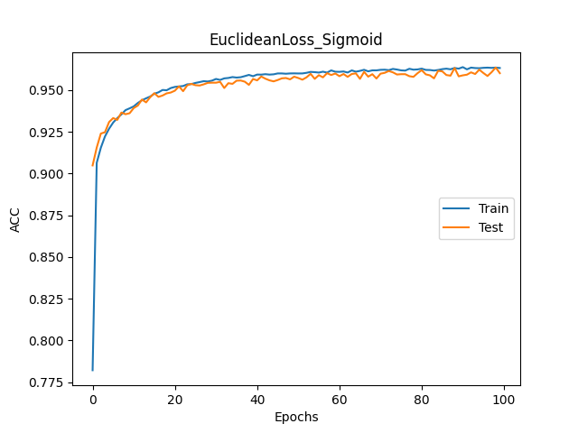
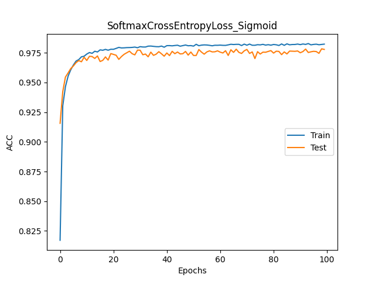
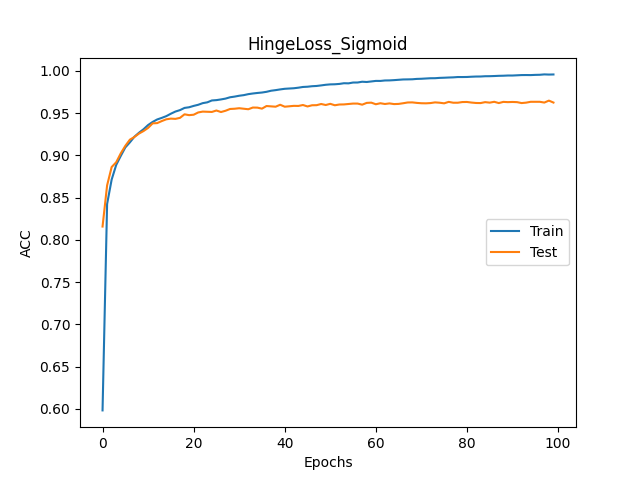
</figure>

<figure>
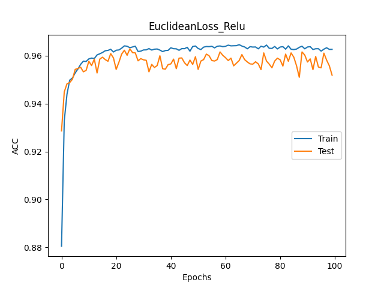
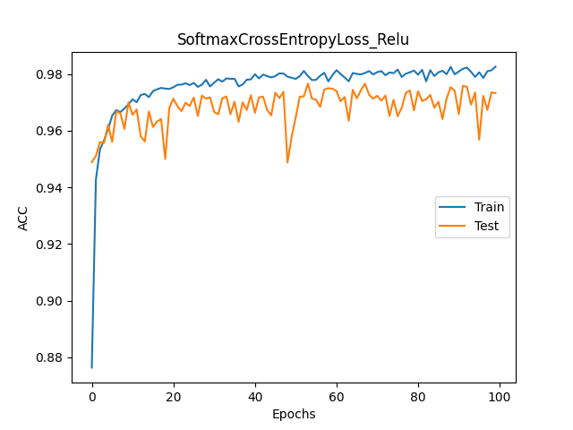
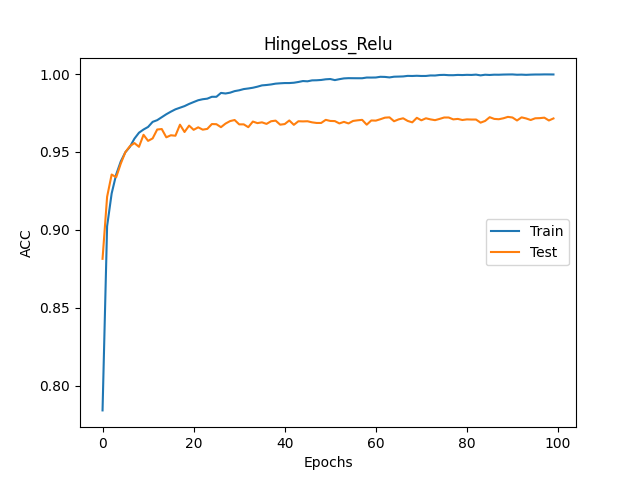
</figure>

<figure>
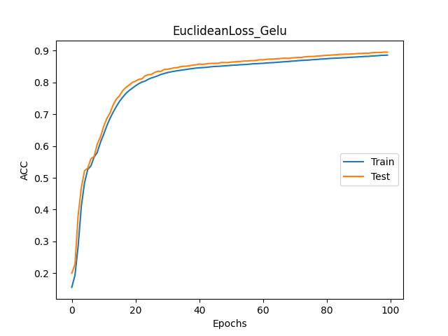
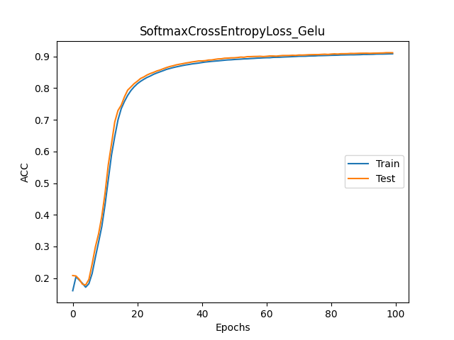
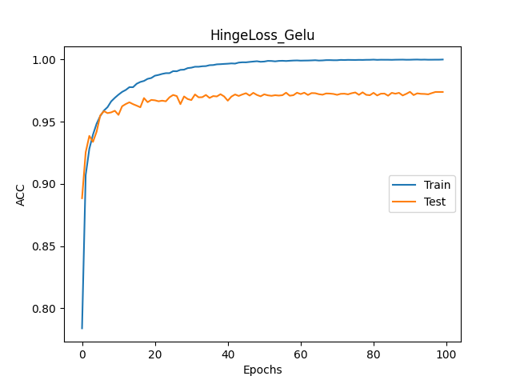
</figure>

+ 九组实验的 `Loss` 结果图如下

<figure>
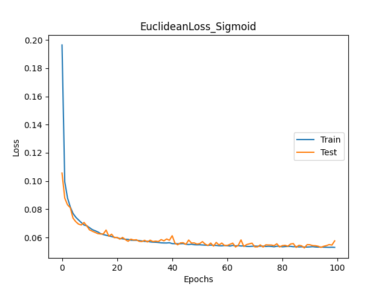
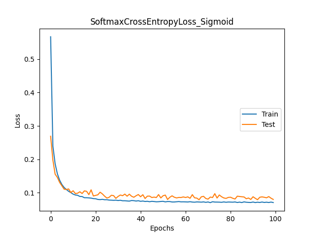
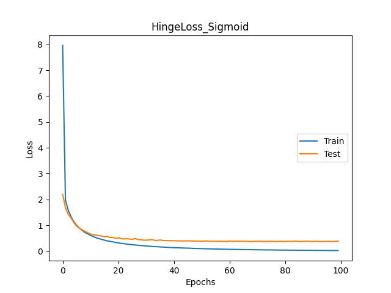
</figure>

<figure>
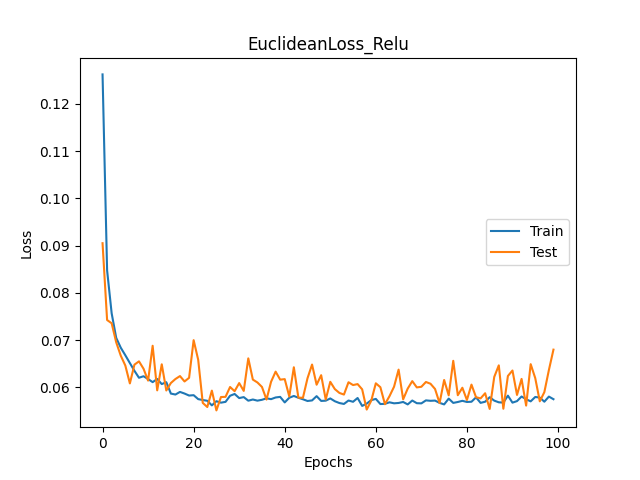
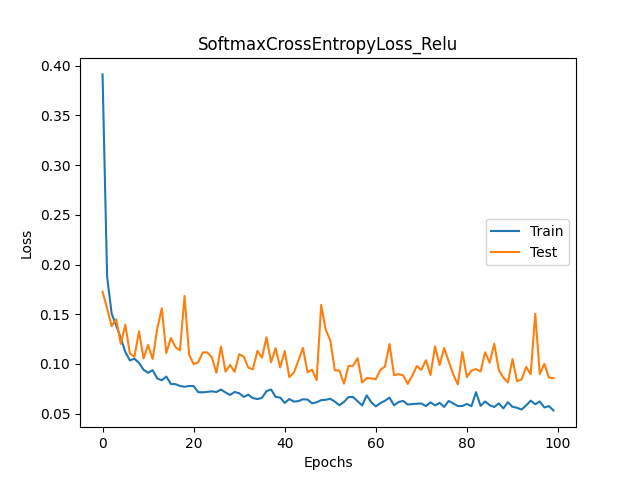
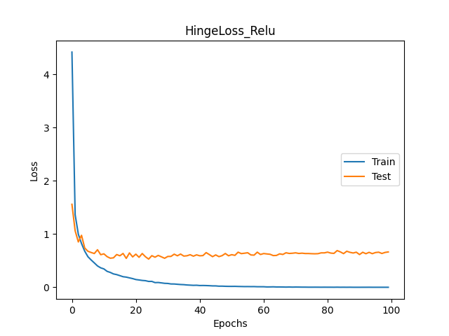
</figure>

<figure>
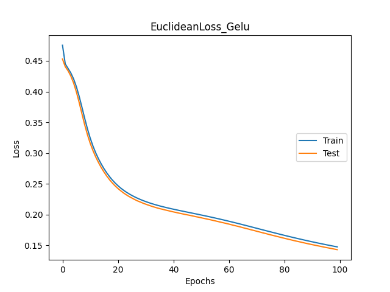
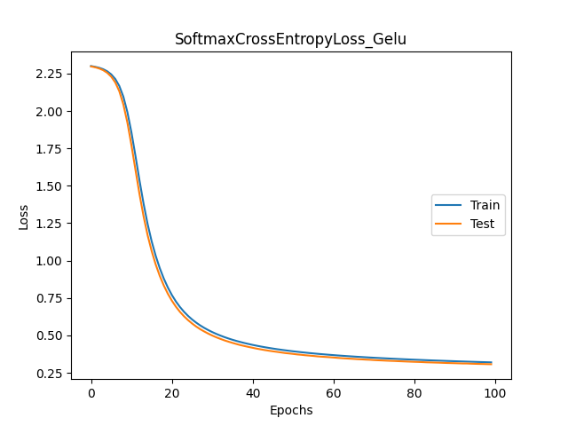
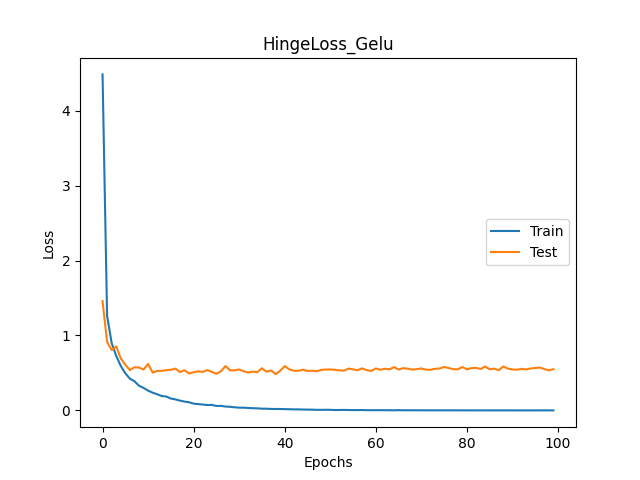
</figure>

#### 1.2.4 实验结果分析

+ 训练时间：

  在相同的 `max_epoch` 和损失函数情况下，考虑三个激活函数，`Gelu` 激活函数对应的三组实验每个 epoch 的平均耗时明显最长，这可能是由于 `Gelu` 相比其他激活函数，前向和反向计算复杂度较高。

  在相同的 `max_epoch` 和激活函数情况下，考虑三个损失函数，同样由于计算量的关系，`SoftmaxCrossEntropyLoss` 对应的三组实验平均耗时较长，但不明显。

+ 收敛速度 & 收敛稳定性：

  在相同的损失函数情况下，考虑三个激活函数，`Gelu` 的收敛速度最慢，可以从图像的斜率上看出来，但 `Gelu` 激活函数对应的三组实验明显收敛更加稳定，无论是在 `Train` 上还是在 `Test` 上都很稳定，而另外两个激活函数相对来说都有波动现象，尤其是 `Relu` 激活函数对应的三组实验，在 `Test` 上的波动现象最明显，`Train` 上也无法收敛到一个比较小的范围内。这可能是由于 `Relu` 的激活函数的梯度要么是 $0$ 要么是 $1$，如果是 $1$ ，可能会造成参数的来回变化，需要进一步调整 `lr` 等参数以收敛到稳定值。

  在相同的激活函数情况下，考虑三个损失函数，由于不同的 `lr` ，`HingeLoss` 和其他两个无法完全控制变量。但通过实验，在 `lr` 较小，即 `lr = 1e-4` 时，`HingeLoss` 的收敛速度最快，可以从 `Loss` 图像上看出其斜率绝对值最大；但在 `lr = 1e-1`，即其他几组实验的 `lr` 下，`HingeLoss` 会发散。同时 `HingeLoss` 也让收敛过程变得稳定，可能是因为 `lr` 较小。

+ 准确率：

  在相同的损失函数情况下，考虑三个激活函数，总体上 `Gelu > Relu > Sigmoid`，`Sigmoid` 在偏离较大的位置的梯度很小，很容易产生梯度消失的问题，而 `Relu` 在大于 $0$ 的部分梯度为 $1$，可能会导致梯度爆炸或者是难以收敛的情况。

  在相同的激活函数情况下，考虑三个损失函数，在 `Train` 数据集上，`HingeLoss > SoftmaxCELoss > EuclideanLoss`，且 `HingeLoss` 能够达到接近 $1$ 的地步；而在 `Test` 数据集上，`SoftmaxCELoss > HingeLoss > EuclideanLoss`。从中可以看出，$100$ 个 epoch 对于 `HingeLoss` 来说有些过拟合了，以至于 `Train` 数据集上表现最优，因此综合来看，在准确率上是 `SoftmaxCELoss ` 最优，`EuclideanLoss` 最次。`SoftmaxCELoss` 能够比较精确地刻画两个概率分布之间的距离，特别是对于这种多分类问题占有比较大的优势；`HingeLoss` 比较适合于 `SVM` 求解，但 `SVM` 求解适合解决二分类问题而不是多分类问题，因为数据的比例不同；`EuclideanLoss` 给每个像素分配相同的权重来计算欧氏距离，比较适合该问题，但如果对于需要对图像不同部分分权重讨论的情况，就可能表现不是那么好了。

## 2. 双隐藏层 `MLP`

### 2.1 实验环境

在该部分中，我们构建一个具有两层隐藏层的 MLP，并对三种激活函数和三种损失函数进行组合，共九种组合。除了模型架构，其余超参与单隐藏层 `MLP` 一致。对于隐藏层的维度，在两层隐藏层实验中，隐藏层维度分别设置为 $256$ 和 $128$。

### 2.2 实验结果

#### 2.2.1 Train

最后一步 Train 之后的结果为：（ACC(delta) / Loss），其中 delta 为相比一层隐藏层的 `MLP` 的变化

| Accuracy / Loss |      EuclideanLoss       |      SoftmaxCELoss       |        HingeLoss         |
| :-------------: | :----------------------: | :----------------------: | :----------------------: |
|   **Sigmoid**   | $0.9665(+0.0041)/0.0434$ | $0.9850(+0.0027)/0.0607$ | $0.9997(+0.0045)/0.0016$ |
|    **ReLU**     | $0.9908(+0.028)/0.0161$  | $0.9815(-0.0012)/0.0583$ | $1.0000(+0.0004)/0.0000$ |
|    **GeLU**     | $0.9864(+0.006)/0.0213$  | $0.9843(+0.0008)/0.0418$ |   $1.0000(+0)/0.0000$    |

#### 2.2.2 Test

最后一步 Test 之后的结果为：（ACC(delta) / Loss），其中 delta 为相比一层隐藏层的 `MLP` 的变化

| Accuracy / Loss |       EuclideanLoss        |       SoftmaxCELoss        |         HingeLoss          |
| :-------------: | :------------------------: | :------------------------: | :------------------------: |
|   **Sigmoid**   | $0.96540(+0.0052)/0.04339$ | $0.97520(-0.0026)/0.08324$ | $0.96850(+0.006)/0.46472$  |
|    **ReLU**     | $0.98040(+0.0285)/0.02183$ | $0.97580(+0.0025)/0.08042$ | $0.97830(+0.0068)/0.86331$ |
|    **GeLU**     | $0.98150(+0.0076)/0.02396$ | $0.96780(-0.0073)/0.10471$ | $0.98020(+0.0063)/0.70596$ |

#### 2.2.3 结果图

+ 九组实验的 `Accuracy` 的结果图如下：

<figure>
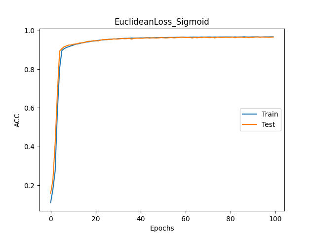
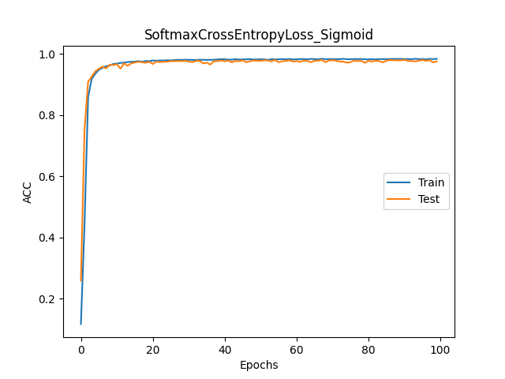
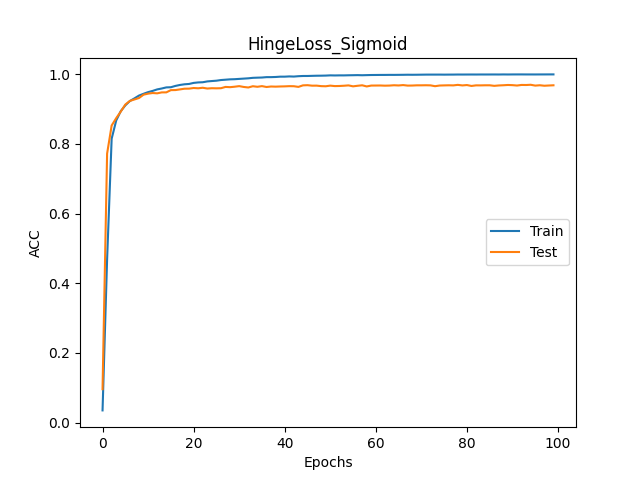
</figure>

<figure>
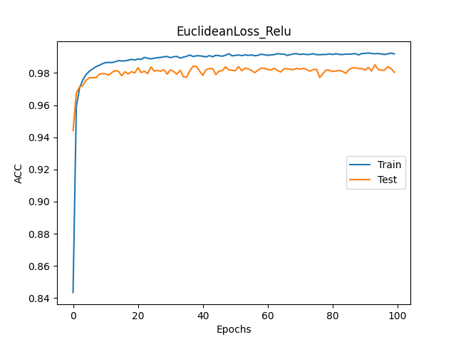
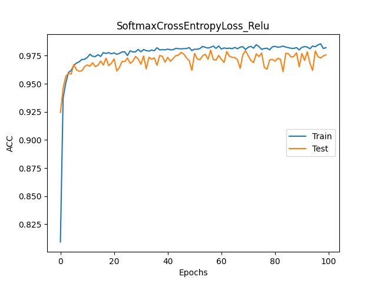

</figure>

<figure>
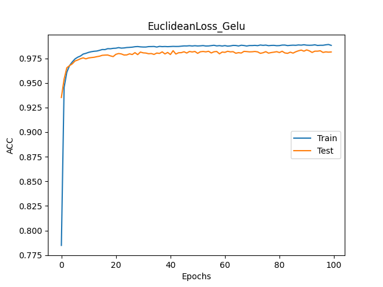
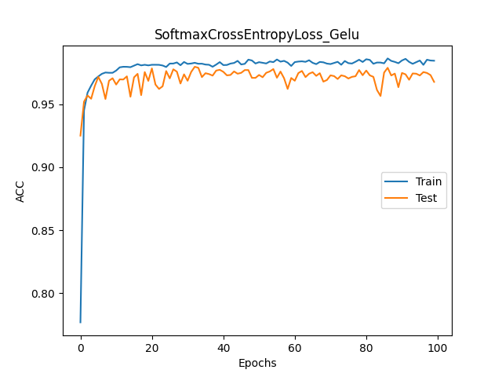
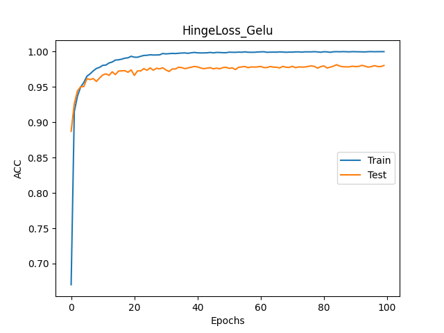
</figure>

+ 九组实验的 `Loss` 结果图如下

<figure>
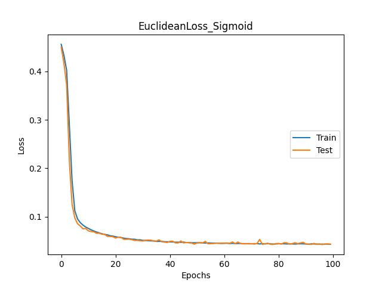
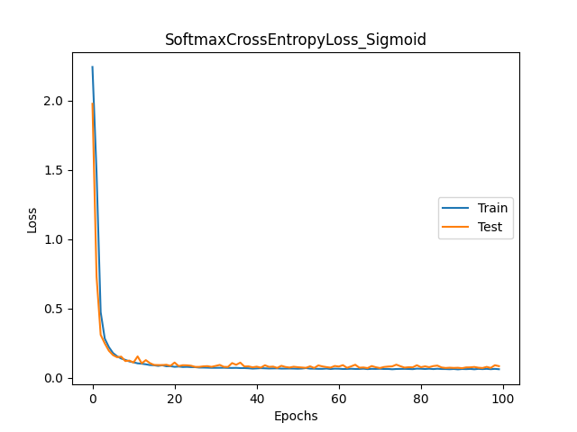
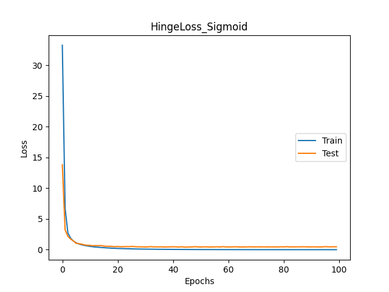
</figure>

<figure>
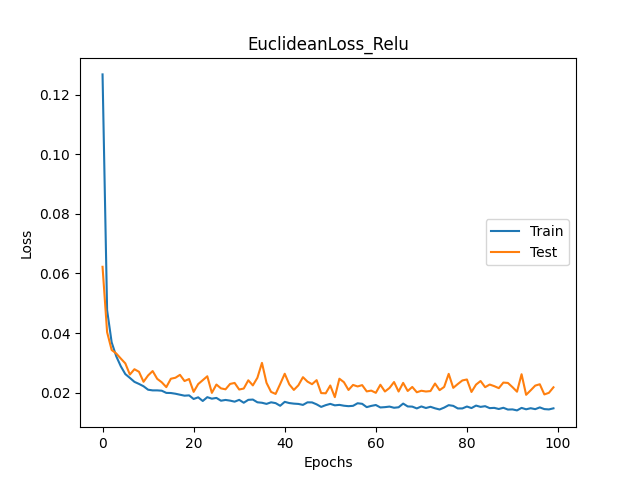
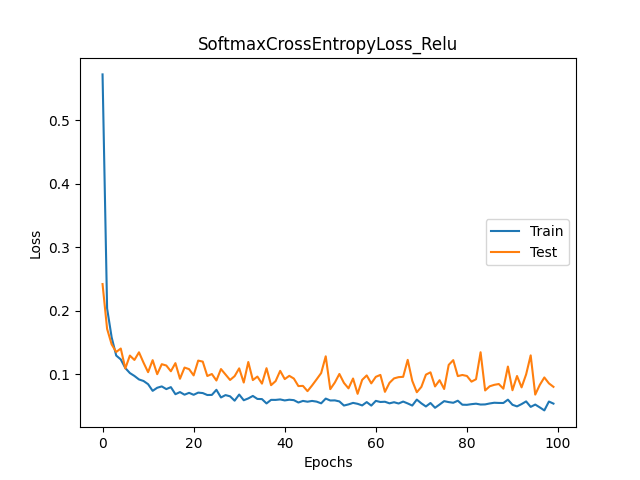
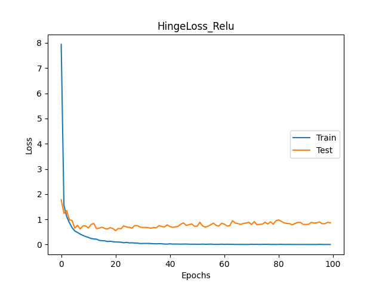
</figure>

<figure>
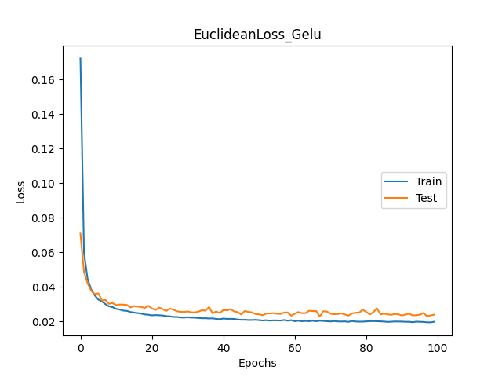
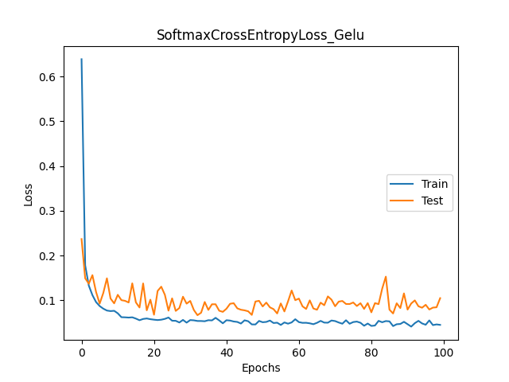
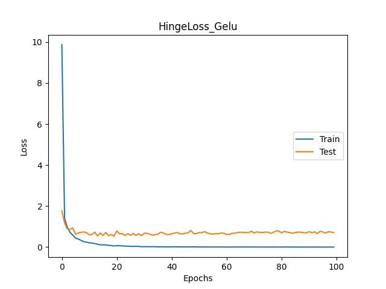
</figure>

#### 2.2.4 实验结果分析

将上述实验结果与对应的一层 `MLP` 实验做对比：

+ 准确率：无论是在 `Train` 还是 `Test` 数据集上，`ACC` 总体上均有所提升，九组实验中 `EuclideanLoss` 和 `Relu` 的一组的 `ACC` 增加最大，高达两个百分点，其余实验的 `ACC` 并没有明显提升。这可能是由于对于并不太复杂的本实验，一层 `MLP` 的参数量已经足够刻画，模型的表达能力已经足够强。
+ 训练时间：由于两层 `MLP` 的网络结构更深更复杂，在每个 epoch 的前向传播和反向传播的计算量都较大，平均训练时间都比较长。
+ 损失函数：两层 `MLP` 对于 `EuclideanLoss` 的促进作用更强，可能是本身 `EuclideanLoss` 对于图像分类时无法对不同手写数字区域赋予不同的权重，毕竟手写数字识别重要的是靠中间部分的像素，绝大多数像素点都是相同的灰度，多一层给了模型更强的表达能力。
+ 激活函数：在激活函数上，三者的差别并不明显。

## 3. Bonus 部分

双层隐藏层的实现以及 comparison study 在前文已经给出，此部分不再赘述。

### 3.1 调参

调参实验主要考虑 `lr: learning_rate`、`bsz: batch_size`、`mm: momentum` 以及 `wd: weight_decay` 四个超参。


### 3.2 计算稳定性

+ 在相同的损失函数下，考虑三个激活函数，可以看出在 `Relu` 激活函数下，模型训练时在 `Train` 数据集上的 `Loss` 和 `ACC` 有较大的波动，且在 `Test` 数据集上的波动更大，这可能是由于 `Relu` 的负数部分恒为 $0$，部分神经元会出现无法激活的情况，并且梯度值要么为 $0$，要么为 $1$，虽然解决了梯度爆炸和消失的问题，但在本实验较大的 `learning_rate` 设置下（`lr =  0.1`），可能会导致模型参数出现波动的情况，从而无法收敛到一个比较小的区间内。剩下两个激活函数中 `Gelu` 是最稳定的，可能是由于 `Gelu` 本身是对数据集做了一个高斯分布的近似，这可能更符合原始数据集的特点。
+ 在相同的激活函数下，考虑 `Euclidean` 和 `SoftmaxCELoss`损失函数，总体上 `SoftmaxCELoss` 相对来说波动较大，可能是由于该损失函数对两个概率分布的误差刻画比较准确，对于较大的 `lr = 0.1`，可能产生波动的情况。而对于 `HingoLoss`，由于 `lr` 选取较小，无法与另外两者做出比较信服的对比。若是也将 `lr` 设置为 $0.1$，实验结果表明 `HingeLoss` 已经无法收敛，计算稳定性比较差。

## 4. 总结

在本实验中，通过手写单层以及双层的 `MLP`，亲自实现反向传播算法，让我对于神经网络的基础部分有了一个更深的认识，在以往基本自己只会使用框架，也没有太多的勇气去尝试自己实现反向传播，但这次实验给了我一个机会，并且实验框架非常的棒！让我们更多地把注意力集中在前向与反向传播上，省去了关于数据处理与载入、模型训练与测试的过程等繁琐事情。

另一方面，通过对比分析以及上手调参，我也对调参这个过程有了一个更直观的感受，尤其是认识到不同的 `lr` 甚至都可能导致模型不收敛，一开始自己写完 `HingeLoss` 之后发现模型 `Loss` 降不下来，还以为写错了，检查了很长时间，结果发现是 `lr` 太大了，这也启示我在神经网络中调参的重要性，并且对于 `learning_rate`、`batch_size`、`weight_decay`、`momentum` 以及隐藏层维度等超参有了一个更直观的认识。

最后，感谢助教和老师提供的清晰的代码框架以及实验指导文档，这次实验让我收获很多！

