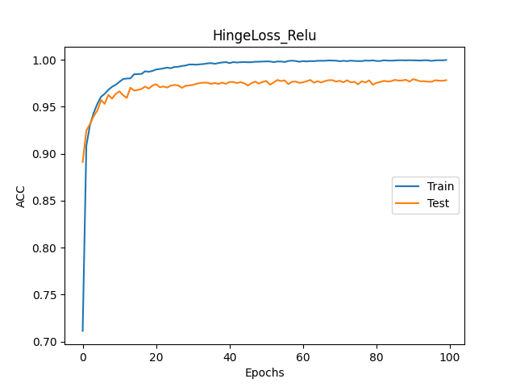

<center><font size=6>ANN Lab1 Report</font></center>

<center><font size=4>何秉翔 计04 2020010944</font></center>

## 1. 单隐藏层 `MLP`

### 1.1 实验环境

在该部分中，我们构建一个具有一层隐藏层的 MLP，并对三种激活函数和三种损失函数进行组合，共九种组合，`numpy` 的 `seed` 为 $42$。其余超参按如下给定：

+ 对于以 `HingeLoss` 作为损失函数的（共三种组合）：

```python
config = {
    'learning_rate': 1e-4,
    'weight_decay': 2e-4,
    'momentum': 0.9,
    'batch_size': 100,
    'max_epoch': 100,
    'disp_freq': 100,
    'test_epoch': 1
}
```

+ 其余六种组合：

```python
config = {
    'learning_rate': 1e-1,
    'weight_decay': 2e-4,
    'momentum': 0.9,
    'batch_size': 100,
    'max_epoch': 100,
    'disp_freq': 100,
    'test_epoch': 1
}
```

**二者只有 `lr` 的区别，原因是 `HingeLoss` 在 `lr` 较大时收敛很慢，甚至难以收敛**

对于隐藏层的维度，在一层隐藏层实验中，隐藏层维度设置为 $128$，`Linear` 初始化 `init_std = 0.01`；对于 `Hinge Loss`，选取 `margin = 5`

### 1.2 实验结果

#### 1.2.1 Train

最后一步 Train 之后的结果为：（ACC / Loss）

| Accuracy / Loss |  EuclideanLoss  |  SoftmaxCELoss  |    HingeLoss    |
| :-------------: | :-------------: | :-------------: | :-------------: |
|   **Sigmoid**   | $0.9624/0.0527$ | $0.9823/0.0710$ | $0.9952/0.0245$ |
|    **ReLU**     | $0.9628/0.0585$ | $0.9827/0.0544$ | $0.9996/0.0008$ |
|    **GeLU**     | $0.9804/0.0422$ | $0.9835/0.0491$ | $1.0000/0.0000$ |

#### 1.2.2 Test

最后一步 Test 之后的结果为：（ACC / Loss）

| Accuracy / Loss |   EuclideanLoss   |   SoftmaxCELoss   |     HingeLoss     |
| :-------------: | :---------------: | :---------------: | :---------------: |
|   **Sigmoid**   | $0.96020/0.05761$ | $0.97780/0.07993$ | $0.96250/0.38458$ |
|    **ReLU**     | $0.95190/0.06800$ | $0.97330/0.08571$ | $0.97150/0.66439$ |
|    **GeLU**     | $0.97390/0.04740$ | $0.97510/0.08543$ | $0.97390/0.54971$ |

#### 1.2.3 结果图

+ 九组实验的 `Accuracy` 的结果图如下：

<figure>


</figure>

<figure>


</figure>

<figure>


</figure>

+ 九组实验的 `Loss` 结果图如下

<figure>


</figure>

<figure>


</figure>

<figure>


</figure>

#### 1.2.4 实验结果分析

+ 训练时间：

  在相同的 `max_epoch` 和损失函数情况下，考虑三个激活函数，`Gelu` 激活函数对应的三组实验每个 epoch 的平均耗时明显最长，这可能是由于 `Gelu` 相比其他激活函数，前向和反向计算复杂度较高。

  在相同的 `max_epoch` 和激活函数情况下，考虑三个损失函数，同样由于计算量的关系，`SoftmaxCrossEntropyLoss` 对应的三组实验平均耗时较长，但不明显。

+ 收敛速度 & 收敛稳定性：

  在相同的损失函数情况下，考虑三个激活函数，`Gelu` 的收敛速度最慢，可以从图像的斜率上看出来，但 `Gelu` 激活函数对应的三组实验明显收敛更加稳定，无论是在 `Train` 上还是在 `Test` 上都很稳定，而另外两个激活函数相对来说都有波动现象，尤其是 `Relu` 激活函数对应的三组实验，在 `Test` 上的波动现象最明显，`Train` 上也无法收敛到一个比较小的范围内。这可能是由于 `Relu` 的激活函数的梯度要么是 $0$ 要么是 $1$，如果是 $1$ ，可能会造成参数的来回变化，需要进一步调整 `lr` 等参数以收敛到稳定值。

  在相同的激活函数情况下，考虑三个损失函数，由于不同的 `lr` ，`HingeLoss` 和其他两个无法完全控制变量。但通过实验，在 `lr` 较小，即 `lr = 1e-4` 时，`HingeLoss` 的收敛速度最快，可以从 `Loss` 图像上看出其斜率绝对值最大；但在 `lr = 1e-1`，即其他几组实验的 `lr` 下，`HingeLoss` 会发散。同时 `HingeLoss` 也让收敛过程变得稳定，可能是因为 `lr` 较小。

+ 准确率：

  在相同的损失函数情况下，考虑三个激活函数，总体上 `Gelu > Relu > Sigmoid`，`Sigmoid` 在偏离较大的位置的梯度很小，很容易产生梯度消失的问题，而 `Relu` 在大于 $0$ 的部分梯度为 $1$，可能会导致梯度爆炸或者是难以收敛的情况。

  在相同的激活函数情况下，考虑三个损失函数，在 `Train` 数据集上，`HingeLoss > SoftmaxCELoss > EuclideanLoss`，且 `HingeLoss` 能够达到接近 $1$ 的地步；而在 `Test` 数据集上，`SoftmaxCELoss > HingeLoss > EuclideanLoss`。从中可以看出，$100$ 个 epoch 对于 `HingeLoss` 来说有些过拟合了，以至于 `Train` 数据集上表现最优，因此综合来看，在准确率上是 `SoftmaxCELoss ` 最优，`EuclideanLoss` 最次。`SoftmaxCELoss` 能够比较精确地刻画两个概率分布之间的距离，特别是对于这种多分类问题占有比较大的优势；`HingeLoss` 比较适合于 `SVM` 求解，但 `SVM` 求解适合解决二分类问题而不是多分类问题，因为数据的比例不同；`EuclideanLoss` 给每个像素分配相同的权重来计算欧氏距离，比较适合该问题，但如果对于需要对图像不同部分分权重讨论的情况，就可能表现不是那么好了。

## 2. 双隐藏层 `MLP`

### 2.1 实验环境

在该部分中，我们构建一个具有两层隐藏层的 MLP，并对三种激活函数和三种损失函数进行组合，共九种组合。其余超参按如下给定：

### 2.2 实验结果

#### 2.2.1 Train

最后一步 Train 之后的结果为：（ACC / Loss）

| Accuracy / Loss |  EuclideanLoss  |  SoftmaxCELoss  |    HingeLoss    |
| :-------------: | :-------------: | :-------------: | :-------------: |
|   **Sigmoid**   | $0.9624/0.0527$ | $0.9823/0.0710$ | $0.9952/0.0245$ |
|    **ReLU**     | $0.9628/0.0585$ | $0.9827/0.0544$ | $0.9996/0.0008$ |
|    **GeLU**     | $0.9804/0.0422$ | $0.9835/0.0491$ | $1.0000/0.0000$ |

#### 2.2.2 Test

最后一步 Test 之后的结果为：（ACC / Loss）

| Accuracy / Loss |   EuclideanLoss   |   SoftmaxCELoss   |     HingeLoss     |
| :-------------: | :---------------: | :---------------: | :---------------: |
|   **Sigmoid**   | $0.96020/0.05761$ | $0.97780/0.07993$ | $0.96250/0.38458$ |
|    **ReLU**     | $0.95190/0.06800$ | $0.97330/0.08571$ | $0.97150/0.66439$ |
|    **GeLU**     | $0.97390/0.04740$ | $0.97510/0.08543$ | $0.97390/0.54971$ |

#### 2.2.3 结果图

+ 九组实验的 `Accuracy` 的结果图如下：

<figure>


</figure>

<figure>



</figure>

<figure>


</figure>

+ 九组实验的 `Loss` 结果图如下

<figure>


</figure>

<figure>


</figure>

<figure>


</figure>

#### 2.2.4 实验结果分析

+ 训练时间：

  在相同的 `max_epoch` 和损失函数情况下，考虑三个激活函数，

  在相同的 `max_epoch` 和激活函数情况下，考虑三个损失函数，

+ 收敛速度 & 收敛稳定性：

  在相同的损失函数情况下，考虑三个激活函数，

  在相同的激活函数情况下，考虑三个损失函数，

+ 准确率：

  在相同的损失函数情况下，考虑三个激活函数，

  在相同的激活函数情况下，考虑三个损失函数，
