<center><font size=6>ANN Lab2 Report</font></center>

<center><font size=4>何秉翔 计04 2020010944</font></center>

## 0. 前言

Lab2 实验主要使用 `PyTorch` 框架对 `CNN` 和 `MLP` 进行搭建，并手动实现 `BatchNorm` 和 `Dropout` ，完成 `cifar-10 classification` 的分类任务，目的在于学会使用深度学习框架去搭建更深的网络架构。

## 1. `MLP`

### 1.1 网络架构

我们采用文档中给出的 `input -- Linear – BN – ReLU – Dropout – Linear – loss` 的架构进行搭建网络，实验中设置的超参数如下：

```python
{
    "dropout_rate": [0.0, 0.1, 0.3, 0.5],          (可改变)
    "batch_size": [50, 100, 200, 500],             (可改变)
    "learning_rate": [0.01, 0.001, 0.0005, 0.0001], (可改变)
    "num_epochs": 50,
    "hidden_size": 1024,
}
```

其中，`hidden_size` 为 `MLP` 网络隐藏层维度，我们固定为 $1024$，固定跑 $50$ 个 `epoch`，网络架构如下：

```shell
Model(                                                                                                   
  (network): Sequential(                               
    (0): Linear(in_features=3072, out_features=1024, bias=True)                                         
    (1): BatchNorm1d()                                 
    (2): ReLU()                                        
    (3): Dropout()                                     
    (4): Linear(in_features=1024, out_features=10, bias=True)                                           
  )                                                    
  (loss): CrossEntropyLoss()                           
)
```

+ `Dropout` 层的实现按照文档给出，若是 `self.training == True`，则对每个神经元随机 `drop` 之后乘上 $(1-p)$ 进行调整，否则直接返回即可。
+ `BatchNorm` 层的实现按照文档和参考文献给出，对 `running_mean` 和 `running_var` 进行记录但不当成模型参数，用于 `inference` 阶段。

### 1.2 最佳实验结果

最佳实验结果的可改变超参为：

|     超参      |  值   |
| :-----------: | :---: |
| dropout_rate  |  0.5  |
|  batch_size   |  500  |
| learning_rate | 0.001 |

最佳实验结果为：

|           结果           |           值           |
| :----------------------: | :--------------------: |
|      training loss       |   0.608461869508028    |
|  **training accuracy**   | **0.7891750365495682** |
|     validation loss      |   1.4441942930221559   |
| **validation accuracy**  | **0.5550000309944153** |
| best validation accuracy |   0.5629000276327133   |
|     final test loss      |   1.359006679058075    |
| **final test accuracy**  | **0.5610000312328338** |

以下结果为最佳实验结果的 `ACC` 和 `Loss` 的图。

<figure>
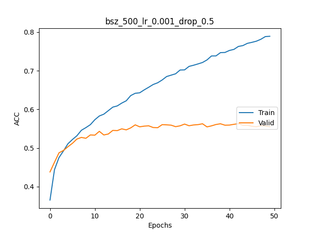
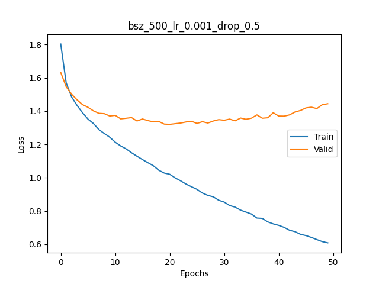
</figure>

### 1.3 无 Dropout 实验

我们使用上述实验效果最好的超参进行实验，此外，将模型架构中的 `Dropout` 层去掉（可以通过 `dropout_rate = 0.0` 实现），模型架构为：`input -- Linear – ReLU – Dropout – Linear – loss`，实验结果如下：

|           结果           |           值           |
| :----------------------: | :--------------------: |
|      training loss       |  0.04587939833290875   |
|  **training accuracy**   | **0.9923500388860702** |
|     validation loss      |   2.2439882874488832   |
| **validation accuracy**  | **0.5269000291824341** |
| best validation accuracy |   0.5409000277519226   |
|     final test loss      |   1.3810120344161987   |
| **final test accuracy**  | **0.5376000240445137** |

<figure>
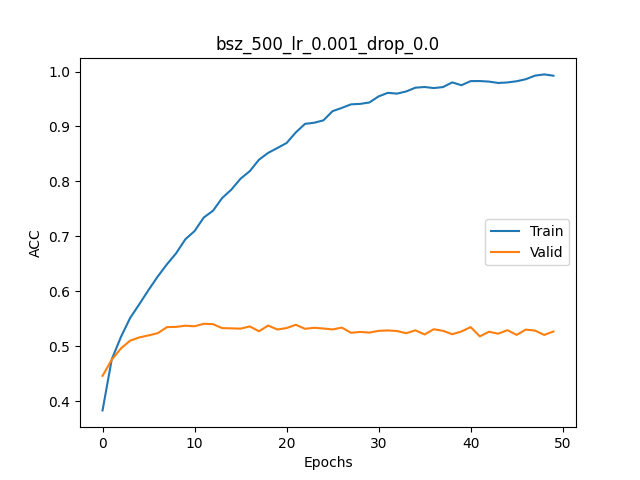
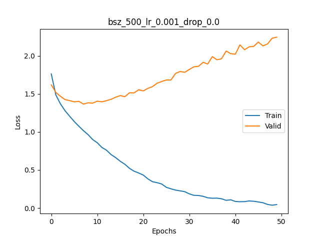
</figure>

实验结果的分析在后面 ~~

### 1.4 无 BatchNorm 实验

我们使用上述实验效果最好的超参进行实验。此外，将模型架构中的 `BatchNorm` 层去掉，模型架构为：`input – Linear – BN – ReLU – Dropout – Linear – loss`，实验结果如下：

|           结果           |           值           |
| :----------------------: | :--------------------: |
|      training loss       |    0.6915876083076     |
|  **training accuracy**   | **0.7644750341773033** |
|     validation loss      |   1.501079499721527    |
| **validation accuracy**  | **0.5545000255107879** |
| best validation accuracy |   0.5635000318288803   |
|     final test loss      |   1.3940251529216767   |
| **final test accuracy**  | **0.5554000198841095** |

<figure>
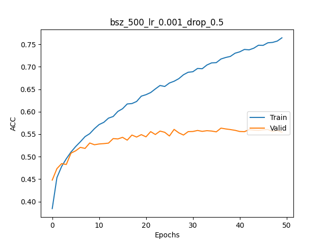
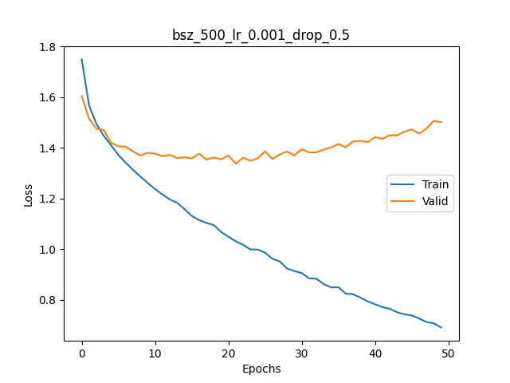
</figure>

实验结果的分析在后面 ~~

## 2. `CNN`

### 2.1 网络架构

我们采用文档中给出的 `input – Conv – BN – ReLU – Dropout – MaxPool – Conv – BN – ReLU – Dropout – MaxPool – Linear – loss` 的架构进行搭建网络，实验中设置的超参数如下：

```python
{
    "dropout_rate": [0.0, 0.1, 0.3, 0.5],          (可改变)
    "batch_size": [50, 100, 200, 500],             (可改变)
    "learning_rate": [0.01, 0.001, 0.0005, 0.0001], (可改变)
    "num_epochs": 50,
    "hidden_channels": (1024, 1024), 	           (两个 channels 均固定为 1024)
    "kernel_size": (5, 5)						   (两个卷积核 kernel_size 均固定为 5x5)
    "MaxPool2d": {                                 (两个最大池化层固定参数)
        "kernel_size": (2, 2),                     (池化核 2x2)
        "stride": (2, 2)                           (步长为 2)
    }
}
```

我们固定跑 $50$ 个 `epoch`，网络架构如下（其余超参默认）：

```shell
Model(                       
  (network): Sequential(             
    (0): Conv2d(3, 256, kernel_size=(5, 5), stride=(1, 1))   
    (1): BatchNorm2d()          
    (2): ReLU()                 
    (3): Dropout()                  
    (4): MaxPool2d(kernel_size=2, stride=2, padding=0, dilation=1, ceil_mode=False)      
    (5): Conv2d(256, 256, kernel_size=(5, 5), stride=(1, 1))   
    (6): BatchNorm2d()   
    (7): ReLU()     
    (8): Dropout() 
    (9): MaxPool2d(kernel_size=2, stride=2, padding=0, dilation=1, ceil_mode=False)          
  )                                                          
  (linear): Linear(in_features=6400, out_features=10, bias=True)                                         
  (loss): CrossEntropyLoss()                                 
)
```

+ `Dropout` 层的实现按照文档给出，若是 `self.training == True`，则对每个通道随机 `drop` 之后乘上 $(1-p)$ 进行调整，否则直接返回即可。
+ `BatchNorm2D` 层的实现按照文档和参考文献给出，对 `running_mean` 和 `running_var` 进行记录但不当成模型参数，用于 `inference` 阶段。

另外，也参考了课件：


### 2.2 最佳实验结果

最佳实验结果的可改变超参为：

|     超参      |  值   |
| :-----------: | :---: |
| dropout_rate  |  0.0  |
|  batch_size   |  100  |
| learning_rate | 0.001 |

最佳实验结果为：

|           结果           |           值           |
| :----------------------: | :--------------------: |
|      training loss       |   0.1002505999733694   |
|  **training accuracy**   | **0.9653749735653401** |
|     validation loss      |   1.233576392531395    |
| **validation accuracy**  | **0.7577999812364579** |
| best validation accuracy |   0.7865999799966812   |
|     final test loss      |   1.1286860883235932   |
| **final test accuracy**  | **0.7769999796152115** |

以下结果为最佳实验结果的 `ACC` 和 `Loss` 的图。

<figure>
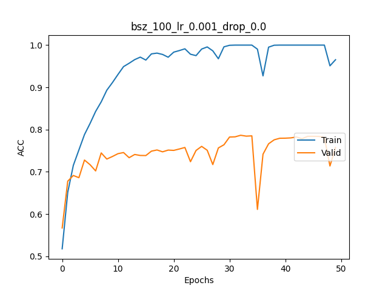
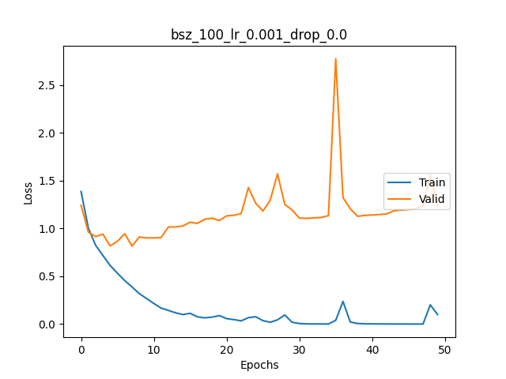
</figure>

### 2.3 无 Dropout 实验

我们使用上述实验效果最好的超参进行实验，此外，将模型架构中的 `Dropout` 层去掉（可以通过 `dropout_rate = 0.0` 实现），模型架构为：`input -- Linear – ReLU – Dropout – Linear – loss`，实验结果即为**上述最佳实验结果**。

实验结果的分析在后面 ~~

### 2.4 无 BatchNorm 实验

我们使用上述实验效果最好的超参进行实验。此外，将模型架构中的 `BatchNorm` 层去掉，模型架构为：`input – Conv – ReLU – Dropout – MaxPool – Conv – ReLU – Dropout – MaxPool – Linear – loss`，实验结果如下：

|           结果           |           值           |
| :----------------------: | :--------------------: |
|      training loss       |  0.06134577980148606   |
|  **training accuracy**   | **0.978524968624115**  |
|     validation loss      |   2.5819300985336304   |
| **validation accuracy**  | **0.6840999847650528** |
| best validation accuracy |   0.717499983906746    |
|     final test loss      |   0.8769321936368942   |
| **final test accuracy**  | **0.7058999854326248** |

<figure>
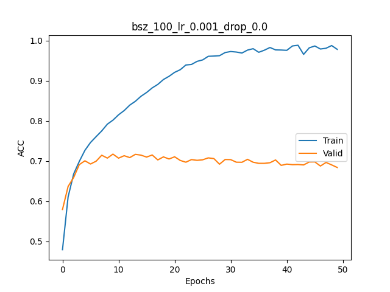
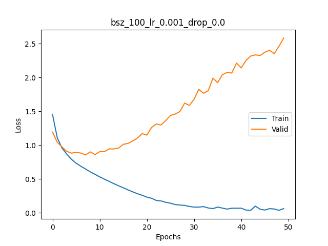
</figure>

实验结果的分析在后面 ~~

### 2.5 `Dropout1d` && `Dropout2D`

|           结果           |       Dropout2d        |       Dropout1d        |
| :----------------------: | :--------------------: | :--------------------: |
|      training loss       |   0.1002505999733694   | 0.0004943044707033551  |
|  **training accuracy**   | **0.9653749735653401** |        **1.0**         |
|     validation loss      |   1.233576392531395    |   1.2217035603523254   |
| **validation accuracy**  | **0.7577999812364579** | **0.7779999768733978** |
| best validation accuracy |   0.7865999799966812   |   0.7817999798059464   |
|     final test loss      |   1.1286860883235932   |   1.1444447153806687   |
| **final test accuracy**  | **0.7769999796152115** | **0.7764999788999557** |

以下是 `Dropout1d` 的图像：

<figure>
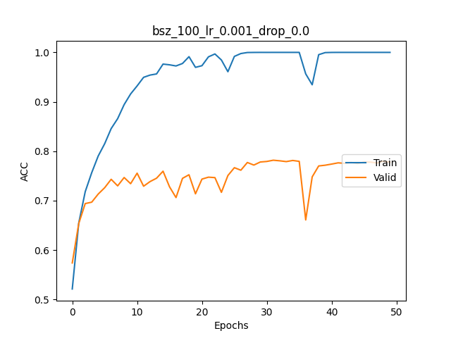
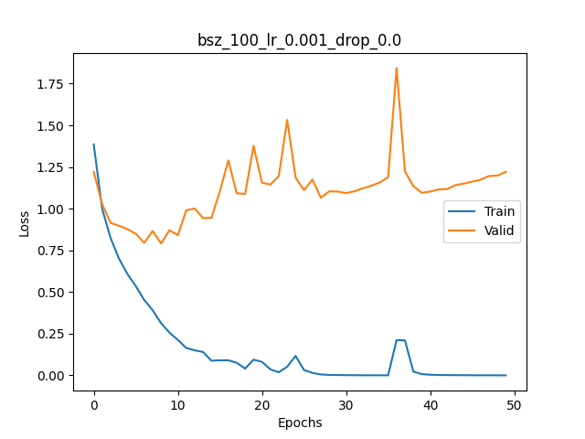
</figure>

以下是 `Dropout2d` 的图像：

<figure>


</figure>

从最终的实验结果可以看出，二者的训练表现并没有太大差别，`Dropout2d` 会略微好于 `Dropout1d`，但是如果从训练的效率上来看， `Dropout1d` 的平均 `epoch` 训练时长大概为 $40s$，但是 `Dropout2d` 的平均 `epoch` 训练时长只需要 $8s$ 左右，可以看出来二者的效率差别是非常大的，更不用说在用到更深的 `CNN` 网络的时候的效率影响了。

因此我们更倾向于在 `CNN` 中使用 `Dropout2d`，将一个通道看成一个整体。事实上，`CNN` 的一个通道可以看成是一个卷积核提取的特征，以特征的粒度来选择是否需要 `drop` 掉，可以理解为 `CNN` 提取了很多的特征，但是有些特征可能有用，有些可能没用，因此 `drop` 掉一整个特征的效率更高也更合理。

## 3. 实验结果分析

### 3.1 BatchNorm 的作用

若对原始数据集如果 `shuffle` 得不够均匀，这有可能导致每个 `batch` 的数据分布不均匀，尤其是在 `batch_size` 较小的时候，这种不均匀现象会更加明显，也因此容易导致模型训练过程出现较大的波动。

基于此，`BatchNorm` 的作用就在于将每一层输入的数据进行归一化，得到一个比较相似的分布，都分布到均值为 $0$ 方差为 $1$ 上，但是如果每一层都这样归一化，又容易导致学习到的特征被破坏，因此考虑增加 $\gamma$ 和 $\beta$ 这两个可学习的参数进行平移和缩放。

我们从图像上也可以观察出来，有 `BatchNorm` 的一组训练时的抖动较小，收敛也比较快。

### 3.2 Dropout 的作用

从 `MLP` 的结果对比上可以看出，有 `dropout` 的一组的 `train ACC` 为 $78.9\%$，没有的一组几乎达到 $100\%$，但是从最终在测试集上的效果来看，反而有 `dropout` 的一组效果更好。

可以看出来，`dropout` 的作用主要是防止出现过拟合的情况，当没有 `dropout` 的时候，`train` 和 `valid` 的差别较大，而且在训练 `epoch` 较多的时候，在 `valid` 集上的 `loss` 甚至还会变大，跟 `train` 背道而驰，很明显出现了过拟合的现象。随着 `dropout` 的加入过拟合现象明显缓解，在后面的调参实验中，我们将给出不同的 `dropout_rate` 下模型的表现，当 `dropout_rate` 过高的时候也可能导致模型出现欠拟合的情况。

但是从 `CNN` 的效果上看，貌似 `dropout_rate = 0`，也就是没有 `dropout` 层的时候效果最好。这可能是我们考虑的超参并不多，比如 `CNN` 网络的通道数、卷积核大小以及 `maxpool` 的大小等参数我们都是定死的，于是考虑设置更小的通道数进行实验，比如设置为 $128$ , 结果发现能得到跟 `MLP` 类似的结论。

## 4. 思考题

### 4.1 self.training 的作用

这是 `PyTorch` 深度学习框架提供的一个内置属性，当对模型调用 `model.train()` 方法的时候，该 `model` 的 `training` 属性就会被设置为 `True`，表示正在训练；同理，如果对模型调用 `model.eval()` 方法，该属性就会被设置为 `False`。

对于 `Dropout` 层和 `BatchNorm` 层，其在 `train` 阶段和 `eval` 阶段的行为并不同，因此我们需要通过该属性来判断目前模型是处于哪个阶段，来进行分别处理。

### 4.2 train_loss 与 valid_loss 的对比

这两个损失分别是在训练集以及验证集上计算而来的，两个数据集并不同。当两者差别较大，而且往往是 `train_loss` 较小而 `valid_loss` 较大的时候，这也就是过拟合的现象，这意味着模型在训练过程中，学习到了训练集上很多特征，但是并不是所有特征都是必要的，这虽然会让模型在训练集表现越来越好，但是当训练集的数据不足以代表更广的数据，比如验证集的数据时，模型的泛化能力就难以增强。

虽然说要学习到足够的特征，但是过于细节的特征学习也许表现并不好，因此这也是一个 `trade-off`，在欠拟合和过拟合之间取得较好的平衡点。我们也从 `Loss` 曲线中可以看出，`train_loss` 基本是一路下滑，但是 `valid_loss` 一般是先下降后上升，因此 `valid_loss` 以及验证集的目的就在于，当发现模型的 `valid_loss` 开始上升时，也就是在转折点处，停止模型的训练，即设置一个 `early_stop` 的阈值，去改善过拟合的问题。

### 4.3 CNN && MLP 对比

`CNN` 以及 `MLP` 最好的结果在下表呈现：

|           结果           |         `CNN`          |         `MLP`          |
| :----------------------: | :--------------------: | :--------------------: |
|      training loss       |   0.1002505999733694   |   0.608461869508028    |
|  **training accuracy**   | **0.9653749735653401** | **0.7891750365495682** |
|     validation loss      |   1.233576392531395    |   1.4441942930221559   |
| **validation accuracy**  | **0.7577999812364579** | **0.5550000309944153** |
| best validation accuracy |   0.7865999799966812   |   0.5629000276327133   |
|     final test loss      |   1.1286860883235932   |   1.359006679058075    |
| **final test accuracy**  | **0.7769999796152115** | **0.5610000312328338** |

从二者的模型架构来对比，可以发现 `CNN` 的模型架构更加复杂，每个 `epoch` 的时间也相对来说更长，但是从最终的表现来看，`CNN` 要明显优于 `MLP`。

相较于 `MLP`，`CNN` 网络实现了局部连接以及权值共享，训练参数量大大减少，而 `MLP` 由于较大的参数量更容易产生过拟合的情况。另外，`CNN` 可以对一个像素块的周围一起进行运算，而不是像 `MLP` 那样平铺地计算，因此 `CNN` 可以对图像的空间信息进行更好的模拟，而 `MLP` 可以看成是卷积核大小为 $1$ 的 `CNN`，图片中相邻像素块的联系并不如 `CNN` 那么紧密，因此 `CNN` 更适合于处理图像信息，更适合于去提取图像中局部的特征。

## 5. 超参实验

此部分里，我们选取 `learning_rate`、`dropout_rate` 以及 `batch_size` 三者进行超参数实验，探究这些超参数是如何影响 `Dropout` 和 `BatchNorm` 层的表现的。

### 5.1 实验设置

首先，`CNN` 和 `MLP` 模型网络均保留 `BatchNorm` 以及 `Dropout` 层，对于 `MLP` 网络，我们的超参设置如下：

```python
{
    "dropout_rate": [0.0, 0.1, 0.3, 0.5],          (可改变)
    "batch_size": [50, 100, 200, 500],             (可改变)
    "learning_rate":[0.01, 0.001, 0.0005, 0.0001], (可改变)
    "num_epochs": 50,
    "hidden_size": 1024,
}
```

对于 `CNN` 网络，我们的超参设置如下：

```python
{
    "dropout_rate": [0.0, 0.1, 0.3, 0.5],          (可改变)
    "batch_size": [50, 100, 200, 500],             (可改变)
    "learning_rate":[0.01, 0.001, 0.0005, 0.0001], (可改变)
    "num_epochs": 50,
    "hidden_channels": (1024, 1024), 	           (两个 channels 均固定为 1024)
    "kernel_size": (5, 5)						   (两个卷积核 kernel_size 均固定为 5x5)
    "MaxPool2d": {                                 (两个最大池化层固定参数)
        "kernel_size": (2, 2),                     (池化核 2x2)
        "stride": (2, 2)                           (步长为 2)
    }
}
```

### 5.2 实验结果

#### 5.2.1 dropout_rate

在调整 `dropout_rate` 时，我们固定其他可改变的超参为对应的最佳实验结果所设置的超参：

```python
{
	"dropout_rate": [0.0, 0.1, 0.3, 0.5], 
    "batch_size": {
        "MLP": 500,
        "CNN": 100,
    },
    "learning_rate": {
        "MLP": 0.001,
        "CNN": 0.001,
    }
}
```

我们首先汇报在这四种 `dropout_rate` 下的实验结果，再进行结果分析。

##### 5.2.1.1 `MLP`

|       dropout_rate       |    0.0     |    0.1     |    0.3     |    0.5     |
| :----------------------: | :--------: | :--------: | :--------: | :--------: |
|      training loss       |   0.0459   |   0.1498   |   0.3399   |   0.6085   |
|  **training accuracy**   | **0.9924** | **0.9565** | **0.8868** | **0.7892** |
|     validation loss      |   2.244    |   1.9759   |   1.708    |   1.444    |
| **validation accuracy**  | **0.5269** | **0.5312** | **0.5362** | **0.5550** |
| best validation accuracy |   0.5409   |   0.5496   |   0.5577   |   0.5629   |
|     final test loss      |   1.381    |   1.464    |   1.357    |   1.359    |
| **final test accuracy**  | **0.5376** | **0.5432** | **0.5517** | **0.5610** |

在训练集和验证集上的 `Accuracy` 和 `Loss` 如下：

<figure>


</figure>

<figure>
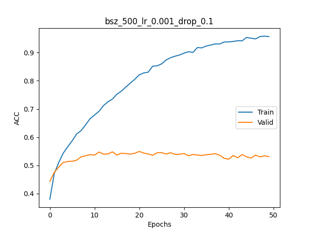
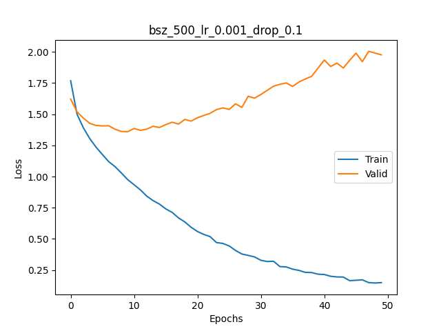
</figure>

<figure>
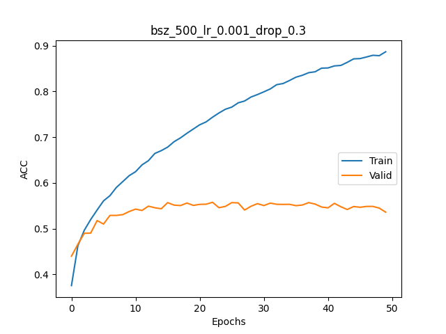
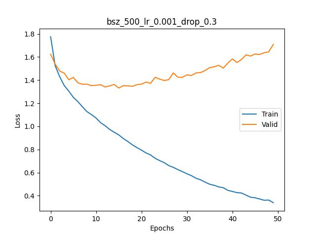
</figure>

<figure>


</figure>

##### 5.2.1.2 `CNN`

|       dropout_rate       |    0.0     |    0.1     |    0.3     |    0.5     |
| :----------------------: | :--------: | :--------: | :--------: | :--------: |
|      training loss       |   0.1003   |   0.0468   |   0.1496   |   0.4503   |
|  **training accuracy**   | **0.9654** | **0.9850** | **0.9493** | **0.8447** |
|     validation loss      |   1.234    |   1.306    |   0.9274   |   0.7266   |
| **validation accuracy**  | **0.7578** | **0.7437** | **0.7495** | **0.7594** |
| best validation accuracy |   0.7866   |   0.7547   |   0.7640   |   0.7657   |
|     final test loss      |   1.129    |   0.9356   |   0.7470   |   0.7335   |
| **final test accuracy**  | **0.7770** | **0.7537** | **0.7542** | **0.7578** |

在训练集和验证集上的 `Accuracy` 和 `Loss` 如下：

<figure>


</figure>

<figure>
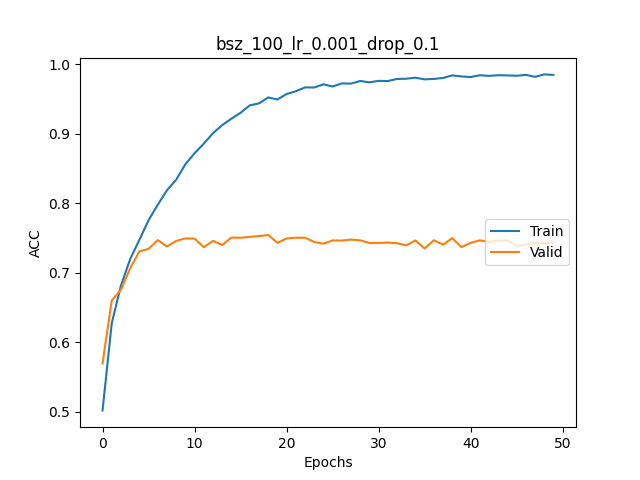
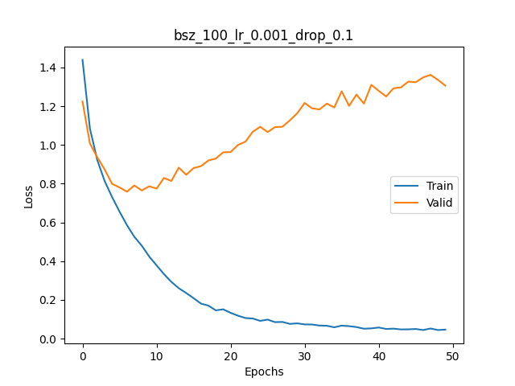
</figure>

<figure>
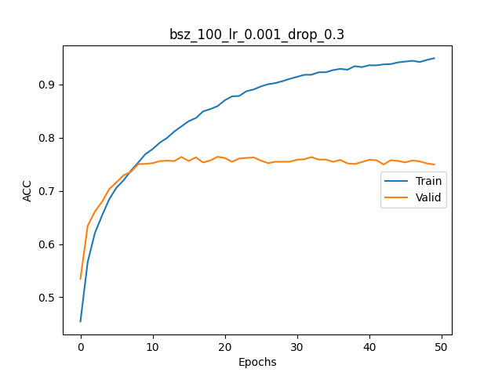
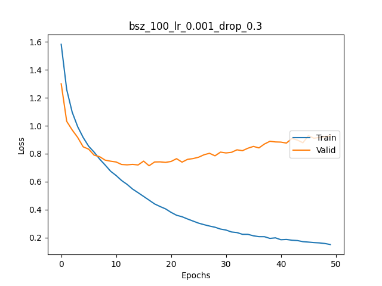
</figure>

<figure>
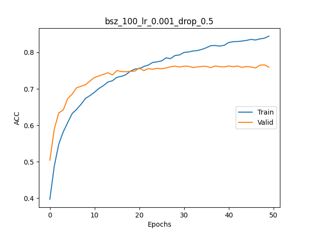
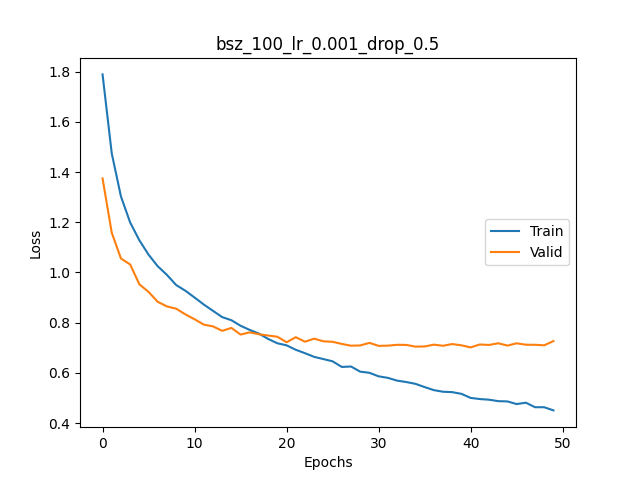
</figure>

##### 5.2.1.3 结果分析

对于 `MLP`，随着 `dropout_rate` 的提高，最后一次训练的 `ACC` 逐渐下降靠近验证集的 `ACC`。一开始没有 `dropout` 时，训练集上的准确率接近 $100\%$ 而验证集只有 $50\%$ 左右，到所测试的最高的 `dropout_rate = 0.5` 时，训练集上的准确率为 $78\%$ 而验证集上为 $55\%$ 左右，很明显看到过拟合的情况有不少缓解。另一方面，我们也可以从图像中看出，随着 `dropout_rate` 的提高，`valid_loss` 曲线的转折点往较大的 `epoch` 处偏移，即说明过拟合情况正在缓解，并且 `valid_loss` 没有反向上升太多。

对于 `CNN`，随着 `dropout_rate` 的提高，训练集上的准确率也逐步向验证集靠拢，并且从曲线中可以看出，在 `CNN` 里，随着 `dropout_rate` 的提高，模型训练的稳定性也提升了，原因可能是调整 `dropout_rate` 时，相当于同时训练了很多个模型，在 `dropout_rate = 0.5` 时，随机 `drop` 的通道数最平均，此时的排列组合方式是最多的，因此相当于是很多的模型平均的效果，使得最后的稳定性有所提升。

从实验结果我们也注意到，其实 `dropout_rate` 的超参实验的参数设置可以更广一些，比如设置 `dropout_rate = 0.7`，因为 `MLP` 和 `CNN` 都只是缓解了过拟合现象，而没有达到一个居中的效果，或者有欠拟合的情况，但是从理论分析上可知，`dropout_rate` 较高时，确实会出现欠拟合的现象，因此我们也测试了 $0.7$ 的情况，发现二者均出现了训练集准确率低于验证集准确率的情况。

#### 5.2.2 batch_size

在调整 `batch_size` 时，我们固定其他可改变的超参为对应的最佳实验结果所设置的超参：

```python
{
    "batch_size": [50, 100, 200, 500], 
    "dropout_rate": {
        "MLP": 0.5,
        "CNN": 0.0,
    }
    "learning_rate": {
        "MLP": 0.001,
        "CNN": 0.001,
    }
}
```

我们首先汇报在这四种 `batch_size` 下的实验结果，再进行结果分析。

##### 5.2.2.1 `MLP`

|        batch_size        |     50     |    100     |    200     |    500     |
| :----------------------: | :--------: | :--------: | :--------: | :--------: |
|      training loss       |   0.4680   |   0.4992   |   0.5452   |   0.6085   |
|  **training accuracy**   | **0.8320** | **0.8219** | **0.8098** | **0.7892** |
|     validation loss      |   2.084    |   1.669    |   1.520    |   1.444    |
| **validation accuracy**  | **0.5162** | **0.5451** | **0.5555** | **0.5550** |
| best validation accuracy |   0.5573   |   0.5582   |   0.5648   |   0.5629   |
|     final test loss      |   1.399    |   1.373    |   1.435    |   1.359    |
| **final test accuracy**  | **0.5513** | **0.5547** | **0.5606** | **0.5610** |

在训练集和验证集上的 `Accuracy` 和 `Loss` 如下：

<figure>
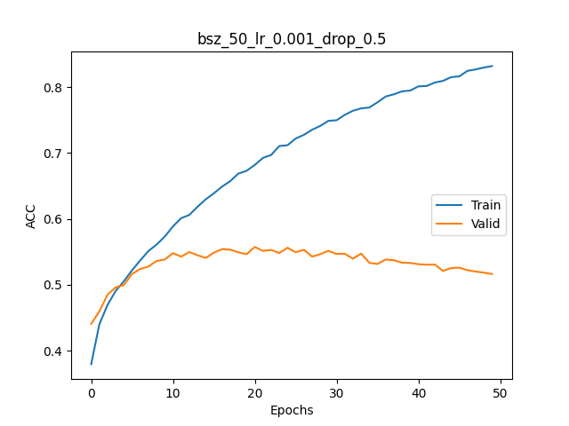
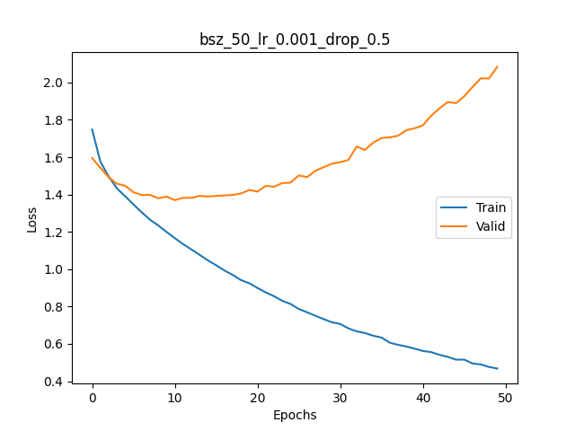
</figure>

<figure>
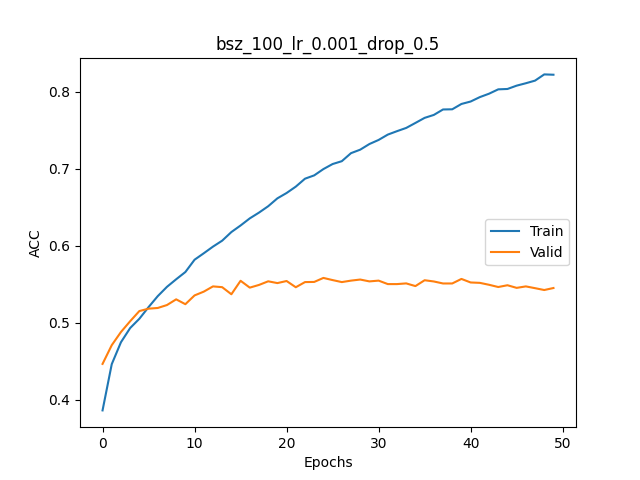
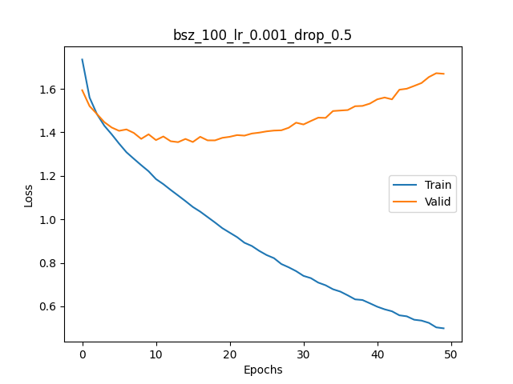
</figure>

<figure>
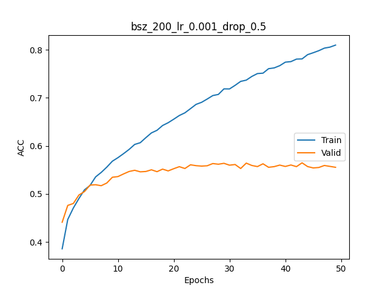
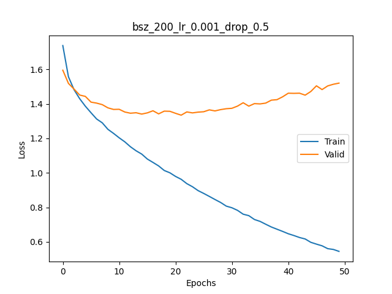
</figure>

<figure>


</figure>

##### 5.2.2.2 `CNN`

|        batch_size        |     50     |    100     |    200     |    500     |
| :----------------------: | :--------: | :--------: | :--------: | :--------: |
|      training loss       |   0.0144   |   0.1003   |   0.0005   |   0.0007   |
|  **training accuracy**   | **0.9956** | **0.9654** |  **1.0**   |  **1.0**   |
|     validation loss      |   1.681    |   1.234    |   1.105    |   1.001    |
| **validation accuracy**  | **0.7483** | **0.7578** | **0.7848** | **0.7803** |
| best validation accuracy |   0.7645   |   0.7866   |   0.7848   |   0.7849   |
|     final test loss      |   1.375    |   1.129    |   1.078    |   0.9452   |
| **final test accuracy**  | **0.7549** | **0.7770** | **0.7747** | **0.7766** |

在训练集和验证集上的 `Accuracy` 和 `Loss` 如下：

<figure>
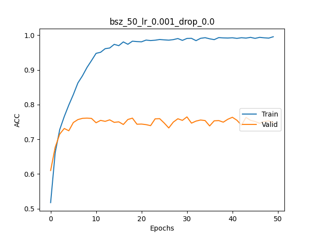
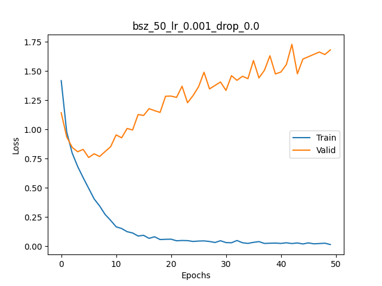
</figure>

<figure>


</figure>

<figure>
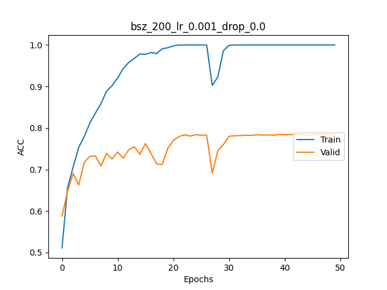
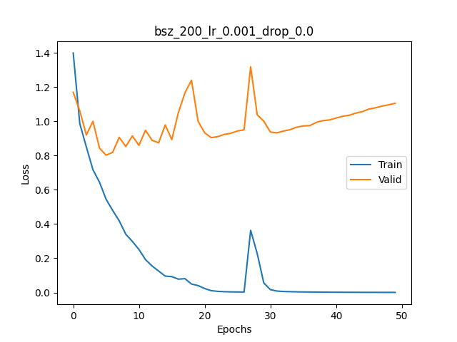
</figure>

<figure>
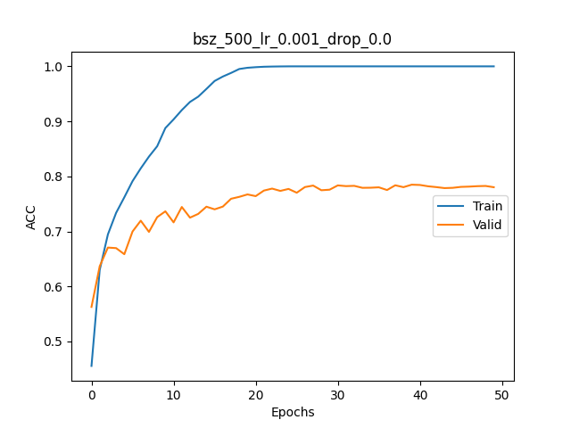
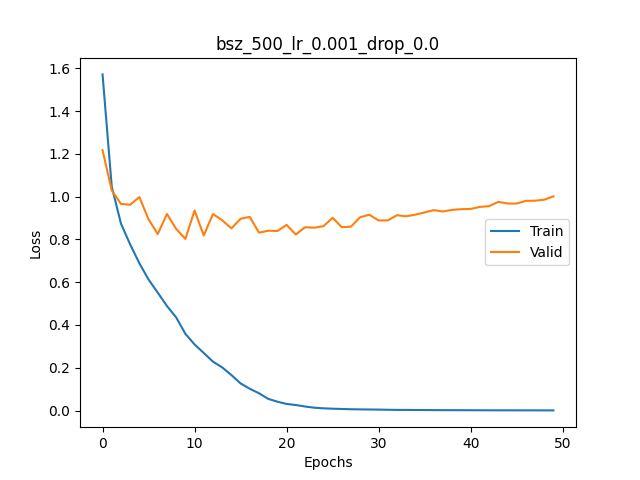
</figure>

##### 5.2.2.3 结果分析

随着 `batch_size` 的增大，`MLP` 和 `CNN` 的表现均有略微提升，虽然 `CNN` 在 $100$ 的时候表现最好，但是 $200$ 和 $500$ 下的测试集准确率与之不相上下，在误差允许范围内。对于 `MLP`，可以看得出来 `batch_size` 的提升使得模型的过拟合程度有所降低，而对于 `CNN` ，从图像上可以看出 $50$ 个 `epoch` 对于 `CNN` 有些过多了，应该差不多 $30$ 个 `epoch` 就足够了，从图像中也可以看出 `valid_loss` 的反向上升现象有所减缓。（另外对于 `batch_size=100` 的一组在训练集上的准确率可能不太具有代表性，从图像中可以看出这是遇到了一些特殊情况，$50$ 个 `epoch` 正好处于尖峰的位置，也说明了模型稳定性还不是很好）

另一方面，从图像上也可以看出来随着 `batch_size` 的提高，`BatchNorm` 对于增强模型的训练稳定性的能力更强。事实上 `BatchNorm` 本意就在于对一个 `batch` 的数据进行归一化，减小不同 `batch` 之间的偏差。如果一个 `batch` 过小，这样的归一化往往不能正确反映数据集的特征，会导致一些误差，使得模型训练过程的波动较大。因此对于 `BatchNorm` 的效果，我们可以适当提高 `batch_size`。

#### 5.2.3 learning_rate

在调整 `learning_rate` 时，我们固定其他可改变的超参为对应的最佳实验结果所设置的超参：

```python
{
    "learning_rate": [0.01, 0.001, 0.0005, 0.0001], 
    "dropout_rate": {
        "MLP": 0.5,
        "CNN": 0.0,
    }
    "batch_size": {
        "MLP": 500,
        "CNN": 100,
    }
}
```

我们首先汇报在这四种 `learning_rate` 下的实验结果，再进行结果分析。

##### 5.2.3.1 `MLP`

|      learning_rate       |    0.01    |   0.001    |   0.0005   |   0.0001   |
| :----------------------: | :--------: | :--------: | :--------: | :--------: |
|      training loss       |   0.5448   |   0.6085   |   0.6746   |   0.7926   |
|  **training accuracy**   | **0.8030** | **0.7892** | **0.7679** | **0.7363** |
|     validation loss      |   1.791    |   1.444    |   1.372    |   1.305    |
| **validation accuracy**  | **0.5284** | **0.5550** | **0.5574** | **0.5569** |
| best validation accuracy |   0.5452   |   0.5629   |   0.5626   |   0.5604   |
|     final test loss      |   1.669    |   1.359    |   1.317    |   1.299    |
| **final test accuracy**  | **0.5451** | **0.5610** | **0.5561** | **0.5539** |

在训练集和验证集上的 `Accuracy` 和 `Loss` 如下：

<figure>
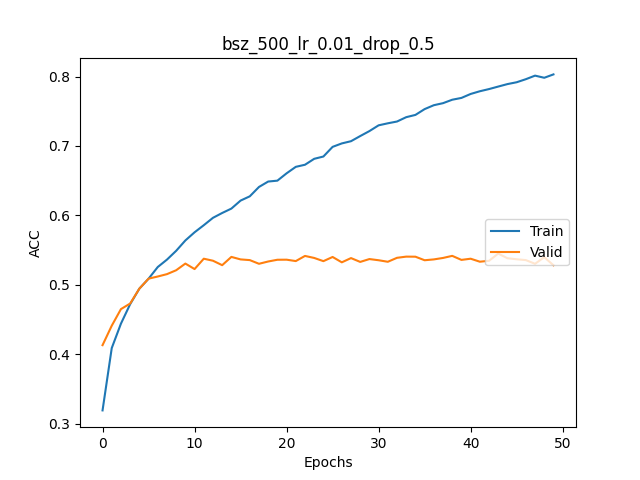
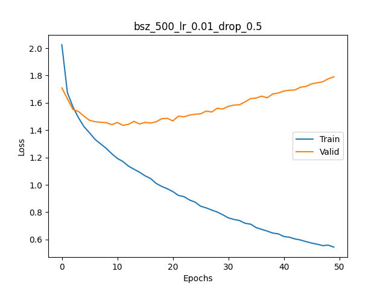
</figure>

<figure>


</figure>

<figure>
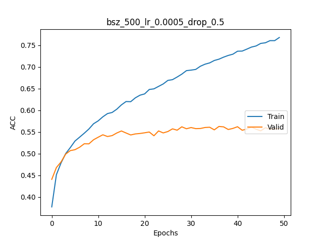
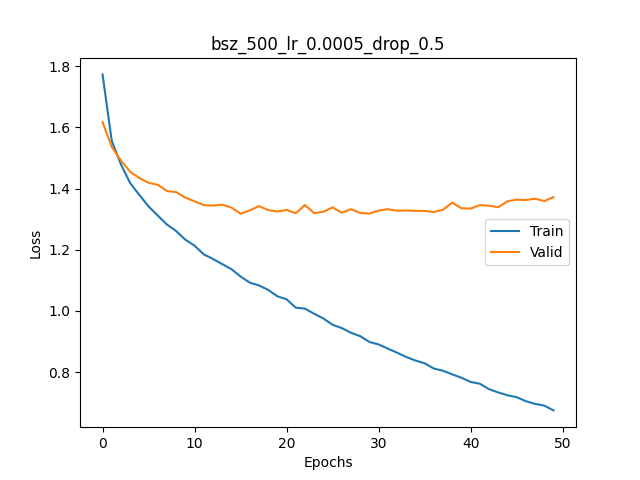
</figure>

<figure>
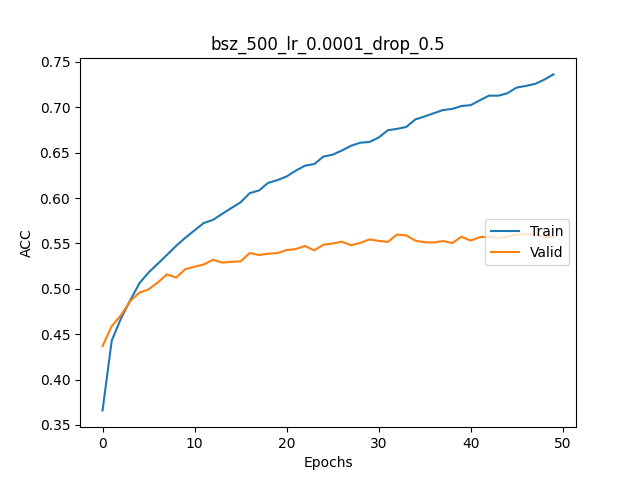
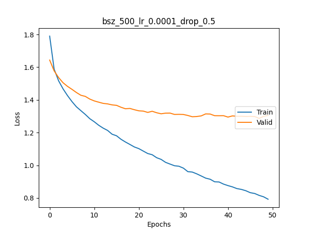
</figure>

##### 5.2.3.2 `CNN`

|      learning_rate       |    0.01    |   0.001    |   0.0005   |   0.0001   |
| :----------------------: | :--------: | :--------: | :--------: | :--------: |
|      training loss       |   0.0947   |   0.1003   |   0.0067   |   0.0229   |
|  **training accuracy**   | **0.9777** | **0.9654** | **0.9998** | **0.9981** |
|     validation loss      |   3.976    |   1.234    |   1.045    |   0.9579   |
| **validation accuracy**  | **0.7083** | **0.7578** | **0.7797** | **0.7518** |
| best validation accuracy |   0.7244   |   0.7866   |   0.7896   |   0.7615   |
|     final test loss      |   0.8922   |   1.129    |   1.006    |   0.9667   |
| **final test accuracy**  | **0.7223** | **0.7770** | **0.7722** | **0.7514** |

在训练集和验证集上的 `Accuracy` 和 `Loss` 如下：

<figure>
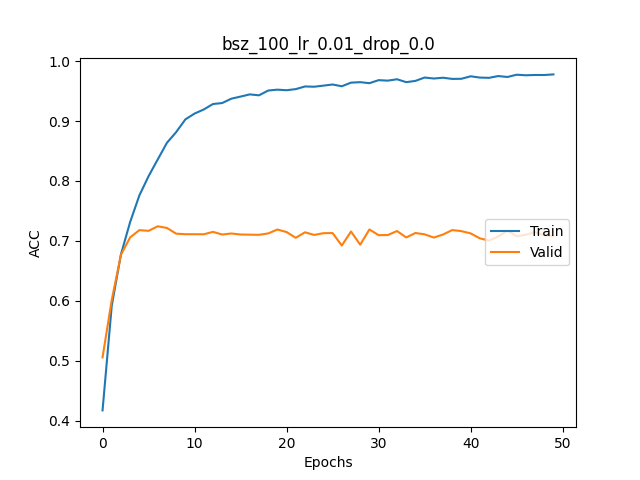
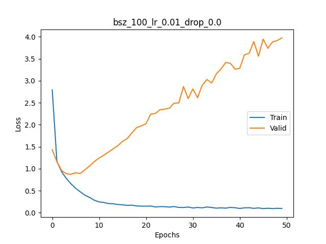
</figure>

<figure>


</figure>

<figure>
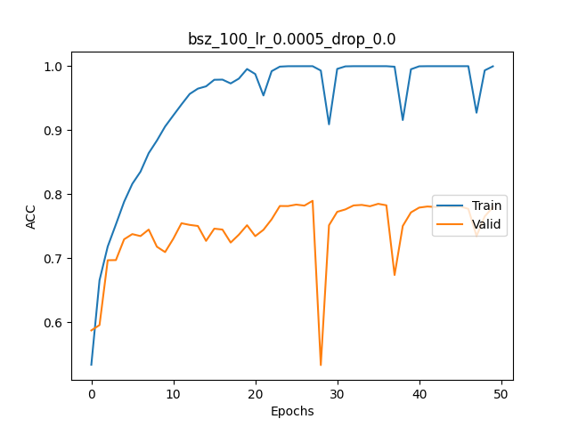

</figure>

<figure>
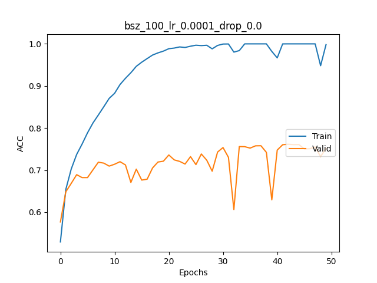
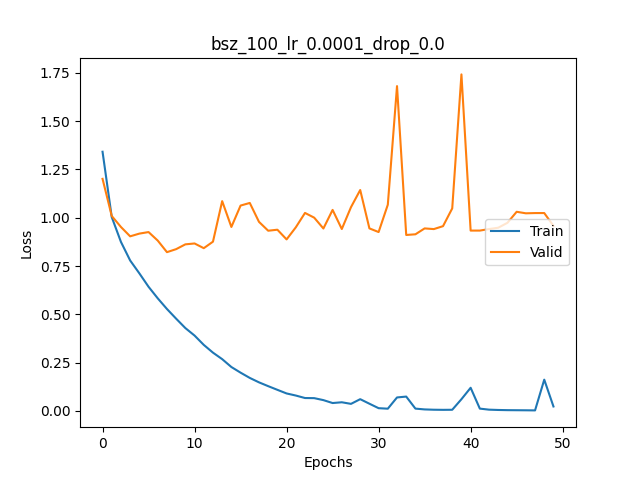
</figure>

##### 5.2.3.3 结果分析

对于 `MLP` 和 `CNN` 而言，较大的学习率虽然能够使得模型训练较快，`Loss` 能很快降下来，但是从图像中可以看出来，验证集上的损失有反向上升的趋势，`MLP` 比 `CNN` 的图像更明显，即 `valid_loss` 的低谷对应的 `epoch` 数随着 `lr` 的增大而减小，这也说明在训练 `epoch` 数与学习率之间存在一个 `trade-off`，如果设置的不好，就容易产生过拟合现象或者欠拟合现象。

同时对于两个网络而言，都是学习率居中的时候在测试集上表现效果最好。当学习率较高的时候，模型容易出现反复横跳的波动情况，难以收敛，当学习率较低的时候，模型容易陷在局部最优解里，无法搜索到全局最优解。

## 6. 总结 

Lab2 实验给了我一个使用 `PyTorch` 深度学习框架自己搭建网络的机会，让我了解了常用的一些属性和方法，比如 `self.training` 以及 `self.register_buffer` 等之前自己未注意到的部分。另外通过手写 `Dropout` 和 `BatchNorm`，我也对这两种神经网络中的技巧以及作用有了更深的认识。

最后，感谢助教和老师提供的清晰的代码框架以及实验指导文档，这次实验让我收获很多！