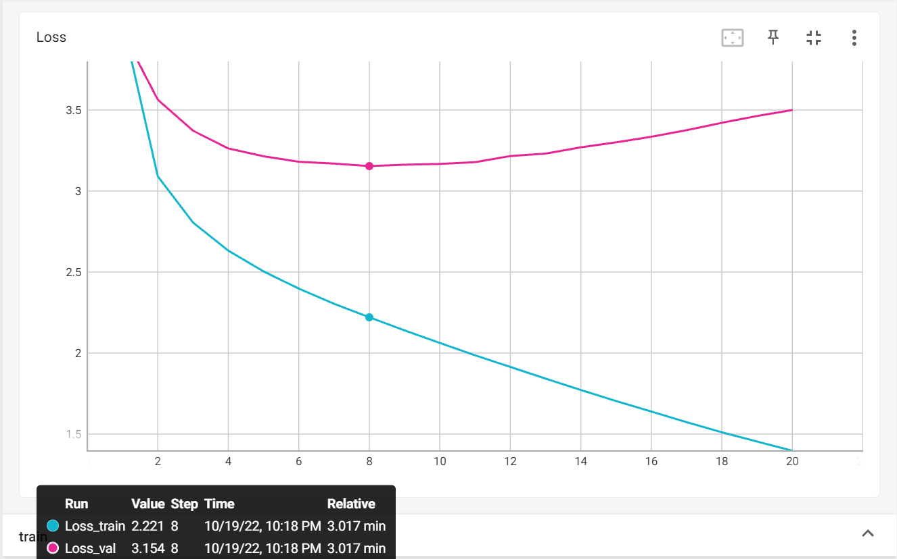

<center><font size=6>ANN Lab3 Report</font></center>

<center><font size=4>何秉翔 计04 2020010944</font></center>

## 0. 前言

Lab3 实验主要使用 `PyTorch` 框架实现一个基于 Transformer 的语言模型，我们需要实现 `Multi-head Self Attention` 的机制，需要全面理解 `Attention` 的原理以及 `Transformer` 的架构。

## 1. 模型训练（`Tfmr-scratch` && `Tfmr-finetune`）

我们未修改任何超参，使用默认超参训练 $20$ 个 `epoch`。

### 1.1 `Tfmr-scratch`

下面分别汇报该模型在 `train` 和 `val` 数据集上的 `loss` 图像，以及在 `val` 上表现最好的模型在 `test` 集上的结果。在 `test` 集上的结果我们采用默认的采样方法，即：

```python
{
    "decode_strategy": "random",
    "temperature": 1.0
}
```

#### 1.1.1 train/val

|      Metric      |  value   |
| :--------------: | :------: |
| Final train loss | $0.9556$ |
|  Final val loss  | $3.9327$ |
|    best epoch    | $6 / 20$ |
|   best val ppl   | $24.17$  |

使用 `Tensorboard` 绘制 `loss` 图像如下：

<center>

</center>


#### 1.1.2 test 结果

|    Metric     | `Tfmr-scratch` |
| :-----------: | :------------: |
|  Perplexity   |    $19.16$     |
| Forward BLEU  |    $0.589$     |
| Backward BLEU |    $0.424$     |
| Harmonic BLEU |    $0.493$     |

### 1.2 `Tfmr-finetune`

下面分别汇报该模型在 `train` 和 `val` 数据集上的 `loss` 图像，以及在 `val` 上表现最好的模型在 `test` 集上的结果。

#### 1.1.1 train/val

|      Metric      |  value   |
| :--------------: | :------: |
| Final train loss | $1.3361$ |
|  Final val loss  | $3.5639$ |
|    best epoch    | $5 / 20$ |
|   best val ppl   | $19.23$  |

`loss` 图像如下：

<center>

</center>
#### 1.1.2 test 结果

|    Metric     | `Tfmr-finetune` |
| :-----------: | :-------------: |
|  Perplexity   |     $15.69$     |
| Forward BLEU  |     $0.573$     |
| Backward BLEU |     $0.435$     |
| Harmonic BLEU |     $0.494$     |

### 1.3 实验结果对比与分析

+ 从 `train/val` 最后的 `loss` 以及最好的 `val ppl` 来看，我们发现经过预训练的模型 `Tfmr-finetune` 在验证集上最好的 `ppl` 更小，而且损失降低得更快，在较早的 `epoch` 就达到的最佳的训练结果。另外，从最后的 `loss` 来看，最后的 `train loss` 在预训练之后的模型上更大，而 `val loss` 在预训练之后的模型上更小，说明预训练后的模型抗过拟合能力较强。 
+ 从二者的过拟合现象来看，两个模型均发生了较严重的过拟合现象，这是由于训练集的句子长度较短，相对于长文本而言比较容易训练。
+ 从 `test` 的指标来看，经过预训练后的模型在 `test` 集合上的 `ppl` 更小，在整体的表现上略好于 `Tfmr-scratch` 的模型。这是因为经过预训练的模型已经具备了一定的语言理解能力，相比随机初始化，具有较强的泛化性，在这个基础上进行 `finetune` 能获得相对更好的效果。从 `Backward BLEU` 的大小来看，经过预训练后的模型的 `diversity` 较强，这与预训练模型的泛化性较强的特点相吻合。而 `diversity` 的增大意味着能选择的 `token` 更多，对于句子的流畅度可能有一定影响，我们也看到 `Forward BLEU` 在预训练过后的模型上较低。

## 2. decode_strategy 探究

### 2.1 实验设置

在本部分，我们直接对任务 $1$ 里的两个模型进行 `inference`。在 `inference` 阶段，分为 `random`、`top-p` 和 `top-k` 三种采样方式，对于每种采样方式，我们调整相应的 `temperature` 参数，共进行如下六组实验：

| 实验编号 | decode_strategy | temperature | top_p | top_k |
| :------: | :-------------: | :---------: | :---: | :---: |
|    1     |     random      |    $1.0$    |   —   |   —   |
|    2     |     random      |    $0.7$    |   —   |   —   |
|    3     |      top-p      |    $1.0$    | $0.9$ |   —   |
|    4     |      top-p      |    $0.7$    | $0.9$ |   —   |
|    5     |      top-k      |    $1.0$    |   —   | $40$  |
|    6     |      top-k      |    $0.7$    |   —   | $40$  |

对于每组实验，我们分别对任务 $1$ 的两个模型 `Tfmr-scratch` 和 `Tfmr-finetune` 进行 `inference`。

### 2.2 test 结果

#### 2.2.1 实验 1

```python
{
    "decode_strategy": "random",
    "temperature": 1.0
}
```

`test` 的实验结果如下：

|    Metric     | `Tfmr-scratch` | `Tfmr-finetune` |
| :-----------: | :------------: | :-------------: |
|  Perplexity   |    $19.16$     |     $15.69$     |
| Forward BLEU  |    $0.589$     |     $0.573$     |
| Backward BLEU |    $0.424$     |     $0.435$     |
| Harmonic BLEU |    $0.493$     |     $0.494$     |

#### 2.2.2 实验 2

```python
{
    "decode_strategy": "random",
    "temperature": 0.7
}
```

`test` 的实验结果如下：

|    Metric     | `Tfmr-scratch` | `Tfmr-finetune` |
| :-----------: | :------------: | :-------------: |
|  Perplexity   |    $19.16$     |     $15.69$     |
| Forward BLEU  |    $0.821$     |     $0.809$     |
| Backward BLEU |    $0.379$     |     $0.381$     |
| Harmonic BLEU |    $0.518$     |     $0.518$     |

#### 2.2.3 实验 3

```python
{
    "decode_strategy": "top-p",
    "temperature": 1.0，
    "top-p": 0.9
}
```

`test` 的实验结果如下：

|    Metric     | `Tfmr-scratch` | `Tfmr-finetune` |
| :-----------: | :------------: | :-------------: |
|  Perplexity   |    $19.16$     |     $15.69$     |
| Forward BLEU  |    $0.711$     |     $0.690$     |
| Backward BLEU |    $0.411$     |     $0.419$     |
| Harmonic BLEU |    $0.521$     |     $0.522$     |

#### 2.2.4 实验 4

```python
{
    "decode_strategy": "top-p",
    "temperature": 0.7，
    "top-p": 0.9
}
```

`test` 的实验结果如下：

|    Metric     | `Tfmr-scratch` | `Tfmr-finetune` |
| :-----------: | :------------: | :-------------: |
|  Perplexity   |    $19.16$     |     $15.69$     |
| Forward BLEU  |    $0.889$     |     $0.883$     |
| Backward BLEU |    $0.298$     |     $0.320$     |
| Harmonic BLEU |    $0.446$     |     $0.470$     |

#### 2.2.5 实验 5

```python
{
    "decode_strategy": "top-k",
    "temperature": 1.0，
    "top-k": 40
}
```

`test` 的实验结果如下：

|    Metric     | `Tfmr-scratch` | `Tfmr-finetune` |
| :-----------: | :------------: | :-------------: |
|  Perplexity   |    $19.16$     |     $15.69$     |
| Forward BLEU  |    $0.692$     |     $0.662$     |
| Backward BLEU |    $0.400$     |     $0.411$     |
| Harmonic BLEU |    $0.507$     |     $0.507$     |

#### 2.2.6 实验 6

```python
{
    "decode_strategy": "top-k",
    "temperature": 0.7，
    "top-k": 40
}
```

`test` 的实验结果如下：

|    Metric     | `Tfmr-scratch` | `Tfmr-finetune` |
| :-----------: | :------------: | :-------------: |
|  Perplexity   |    $19.16$     |     $15.69$     |
| Forward BLEU  |    $0.836$     |     $0.825$     |
| Backward BLEU |    $0.356$     |     $0.367$     |
| Harmonic BLEU |    $0.500$     |     $0.508$     |

### 2.3 实验结果对比与分析

`perplexity` 的结果只与模型有关，即 `Tfmr-scratch` 和 `Tfmr-finetune`，具体的 `decode_strategy` 和 `temperature` 只会影响生成的句子以及 `BLEU` 的结果。

#### 2.3.1 不同 decode_strategy

固定其他超参不变，我们看三种 `decode_strategy` 对 `BLEU` 的结果的影响。

+ 对于 `Forward BLEU`：最终的结果是 `top-p > top-k > random`，因为 `Forward BLEU` 测量的是句子的 `fluency`，`top-p` 方法是在概率较大的 `token` 上进行保留采样，使得生成的句子更加符合语义更加通顺。而 `top-k` 保留概率最大的 $k$ 个单词，相对来说生成的句子语义也比较通顺，而两种 `top` 采样在该指标上的不同可能是由于 `p` 和 `k` 参数引起的。而对于 `random` 采样，下一个单词的选取是在所有 `token` 上进行采样的，相较于在概率较大的 `token` 集上采样，生成句子的通顺度并不高。
+ 对于 `BackWard BLEU`：最终的结果是 `random > top-p ~ top-k`，因为 `Backward BLEU` 测量的是句子的 `diversity`，`random` 采样方法保留了所有的 `token` 进行采样，而不像 `top` 采样保留了部分概率较大的 `token`，所以 `random` 采样方法使得预测的 `token` 具有较大的 `diversity`。
+ 对于 `Harmonic BLEU`：最终的结果是，在 `temperature = 1.0`，较大的时候，有 `top-p > top-k > random`；但在 `temperature = 0.7` 时，有 `random > top-p ~ top-k`。在 `t` 较大的时候，新的概率分布更加均匀，则随机性越大，此时如果限制概率较低的词不参与采样，效果会更好，因此 `top` 采样较优。而当 `t` 较小的时候，新的概率分布差距更大，更加集中，这可能导致诸如 `the`、`a` 等词的概率过于集中，而如果选取 `top` 采样，则会限制其他的词，使得生成的效果反而不好，此时采用 `random` 的效果可能更好。

#### 2.3.2 不同 temperature

固定其他超参不变，我们看两种 `temperature` 对 `BLEU` 的结果的影响。

+ 对于 `Forward BLEU`：最终的结果是 `temperature` 较小的一组更大，这是因为 `t` 越小时，概率分布差距会比较大，更加集中，更容易采样到小范围的概率较高的 `token`，因而句子的流畅度较高。
+ 对于 `Backward BLEU`：最终的结果是 `temperature` 较小的一组更小，这是因为 `t` 越小时，概率分布更加集中，容易采样到小范围的概率较高的 `token`，可选择的 `token` 数较少，句子的 `diversity` 更不明显。
+ 对于 `Harmonic BLEU`：需要视具体的 `decode_strategy` 而定，分析与 `2.3.1` 的 `Harmonic BLEU` 一样。

#### 2.3.3 不同模型

固定其他超参不变，我们看两种模型对 `BLEU` 的结果的影响。

此时，对于各组实验而言，结果与 `1.3` 中分析的情况均一致，即 `Forward BLEU` 在预训练过后的模型上更小，而另外两种 `BLEU` 指标在预训练过后的模型上更大。

## 3. 句子生成

### 3.1 结果展示

#### 3.1.1 实验 1

```python
{
    "decode_strategy": "random",
    "temperature": 1.0
}
```

+ `Tfmr-scratch`：

```shell
A hanging hangs from a restroom that 【dog as other dogs】 .
Three people are on a park bench with a dog on the ground .
Three buses parked next to each other on a field .
Picture of sunset at night time at night time scene with a dark lights in the background .
【two】 sheep are standing in a field next to a fence .
A little dog looking at red while pigeons 【Bows】 on them .
There are two elephants coming down the road facing a lake .
A bus driving past a rural area , during the day .
A black and green bus is parked next to each other .
A giraffe standing 【next to a white outsideseat while an enclosure】 .
```

【语法错误示例】以 `【】` 标出了一些例子

+ `Tfmr-finetune`

```shell
A hanging train car on the side of the road .
Three people are on a bike on the street and appears to be a small girl and looking at it .
Three buses parked next to each other on a field .
Picture of sunset at night time 【scene at night】 .
【two】 giraffe stand in a field next to a fence .
Dog on dog looking at cats while pigeons are looking down .
There is a horse coming down the road facing a large body of water .
A bus driving past a rural area covered in snow .
A black and white wedding couple sitting next to each other .
A giraffe standing next to a white and green fence .
```

【语法错误示例】以 `【】` 标出了一些例子

#### 3.1.2 实验 2

```python
{
    "decode_strategy": "random",
    "temperature": 0.7
}
```

+ `Tfmr-scratch`：

```shell
A man standing next to a fire hydrant on a sidewalk .
A red and white fire hydrant sitting on the side of a road .
A big giraffe standing in a field with a tree .
A couple of giraffes stand in a grassy field .
A blue bus driving down a road next to a sidewalk .
A little dog is sitting on top of a bench .
A red and white bus stopped at a light in a city .
A bus driving past a rural area , with a big building .
A black and white photo of two giraffes in a pen .
A giraffe standing next to a tree filled with rocks .
```

【语法错误示例】无

+ `Tfmr-finetune`

```shell
A man standing next to a fire hydrant on the sidewalk .
A view of the city of a downtown area with cars and a bus parked in the background .
A big big city bus driving down a street with a traffic light .
A couple of giraffes stand in a grassy field .
A woman sitting on top of a wooden bench on a hillside .
A fire hydrant sitting on top of a dirt field .
A red and white bus driving past a row of trees .
A bus driving down a rural area with mountains in the background .
A black and white photo of a man sitting on the bench .
A giraffe standing next to a tree filled with trees .
```

【语法错误示例】无

#### 3.1.3 实验 3

```python
{
    "decode_strategy": "top-p",
    "temperature": 1.0，
    "top-p": 0.9
}
```

+ `Tfmr-scratch`：

```shell
A man standing next to a fire hydrant on a sidewalk in front of the trees .
Three people are on a park bench with a dog on the ground .
Three buses parked next to each other on a field .
A couple of giraffes stand in a grassy field .
A blue bus driving down a road next to a sidewalk .
A little girl looking at two sheep 【while somethingling】.
A red and white bus stopped at a light parked .
A bus driving past a rural area , during the day .
A black and white photo of two giraffes from a tree .
A giraffe standing next to 【a white outside of a tree 】.
```

【语法错误示例】以 `【】` 标出了一些例子

+ `Tfmr-finetune`

```shell
A man standing next to a fire hydrant on the sidewalk .
Three people are on a bike on the street and buses .
Three buses parked next to each other on a field .
A couple of giraffes stand in a grassy field next to trees .
A blue bus driving down a road next to a red brick building .
A little girl looking at some animals beside the cattle .
There is a horse drawn carriage in the middle of the road .
A bus driving past a rural area covered in snow .
A black and white photo of the inside of a hangar .
A giraffe standing next to a white and green fence .
```

【语法错误示例】无

#### 3.1.4 实验 4

```python
{
    "decode_strategy": "top-p",
    "temperature": 0.7，
    "top-p": 0.9
}
```

+ `Tfmr-scratch`：

```shell
A man standing next to a fire hydrant on a sidewalk .
A red and white fire hydrant sitting on the side of a road .
A yellow bus is travelling down a street next to a building .
A couple of giraffes stand in a grassy field .
A blue bus driving down a street next to a sidewalk .
A bus is parked in front of a parking lot .
A red and white bus driving down a city street .
A bus driving past a tall building with a tree .
A black and white photo of two giraffes in a pen .
A giraffe standing next to a tree filled with rocks .
```

【语法错误示例】无

+ `Tfmr-finetune`

```shell
A man standing next to a fire hydrant on the sidewalk .
A view of a city street with lots of traffic .
A yellow bus is travelling down the street with a crowd of people standing .
A couple of giraffes stand in a grassy field .
A woman sitting on top of a wooden bench on a hillside .
A fire hydrant sitting on top of a dirt field .
A red and white bus driving down a street in the rain .
A bus driving down a street with cars in the background .
A black and white photo of a man sitting on a bench .
A giraffe standing next to a tree filled with trees .
```

【语法错误示例】无

#### 3.1.5 实验 5

```python
{
    "decode_strategy": "top-k",
    "temperature": 1.0，
    "top-k": 40
}
```

+ `Tfmr-scratch`：

```shell
A man standing next to a fire hydrant on a sidewalk in front of 【snow covered trees】 .
Three people are on a park bench with a dog on the ground .
Three buses parked next to each other on a field .
A couple of giraffes stand in a grassy field .
A blue bus makes its way through an apartment area .
A little dog looking at a sheep while something 【it ' s hand 】.
There are two men sitting on benches next to a tree .
A bus driving past a tall building at an empty street .
A black and green bus is parked next to each other .
A giraffe standing next to a white and green fence .
```

【语法错误示例】以 `【】` 标出了一些例子

+ `Tfmr-finetune`

```shell
A man standing next to a fire hydrant on the sidewalk .
Three people are on a bike on the street and buses in the background .
Three buses parked next to each other on a field .
【a】 couple of benches sitting beneath a flowery old metal fence .
A blue bus makes its way through the streets on a rainy day .
A little dog looking at some animals beside the cattle .
There is a herd of animals grazing in the grass .
A bus driving past a stop on a rainy day .
A black and white photo of the inside of a hangar .
A giraffe standing next to a white and green fence .
```

【语法错误示例】以 `【】` 标出了一些例子

#### 3.1.6 实验 6

```python
{
    "decode_strategy": "top-k",
    "temperature": 0.7，
    "top-k": 40
}
```

+ `Tfmr-scratch`：

```shell
A man standing next to a fire hydrant on a sidewalk .
A red and white fire hydrant sitting on the side of a road .
A big giraffe standing in a field with a tree .
A couple of giraffes stand in a grassy field .
A blue bus driving down a road next to a sidewalk .
A little dog is sitting on top of a bench .
A red and white bus stopped at a light in a city .
A bus driving past a tall building at a traffic light .
A black and white photo of two giraffes in a pen .
A giraffe standing next to a tree filled with rocks .
```

【语法错误示例】无

+ `Tfmr-finetune`

```shell
A man standing next to a fire hydrant on the sidewalk .
A view of the city of a downtown area with cars and a bus parked in the background .
A yellow bus is travelling down the street with a crowd of people standing and walking across the street .
A couple of giraffes stand in a grassy field .
A woman sitting on top of a wooden bench on a hillside .
A fire hydrant sitting on top of a dirt field .
A red and white bus driving past a row of trees .
A bus driving down a rural area with mountains in the background .
A black and white photo of a man sitting on the bench .
A giraffe standing next to a tree filled with trees .
```

【语法错误示例】无

### 3.2 结果分析

#### 3.2.1 不同 decode_strategy

`top` 的采样策略下生成的句子相对来说语义更加通顺：

```shell
【random】A giraffe standing next to a white outsideseat while an enclosure .
【top-p】A giraffe standing next to a white outside of a tree .
【top-k】A giraffe standing next to a white and green fence .
```

在其它参数相同的情况下，我们选取同一位置产生的句子进行对比，可以看出 `top` 策略下句子更加流程且语法错误减少了。再比如：

```shell
【random】Picture of sunset at night time at night time scene with a dark lights in the background .
【top-p】A couple of giraffes stand in a grassy field .
【top-k】A couple of giraffes stand in a grassy field .
```

#### 3.2.2 不同 temperature

我们考虑：

```shell
【t = 0.7】A man standing next to a fire hydrant on a sidewalk .
【t = 1.0】A man standing next to a fire hydrant on a sidewalk in front of snow covered trees .
```

可以发现，`t` 较小的时候加大了某些概率较大的 `token` 被选中的概率，使得句意更加通顺，特别是该停止的时候就停止。再比如：

```shell
【t = 0.7】A red and white bus driving down a city street .
【t = 1.0】A red and white bus stopped at a light parked .
```

可以看出 `t` 较小的时候更加通顺，也没有语义上或者逻辑上的问题。

#### 3.2.3 不同模型

相对来说，经过预训练的模型的语法错误较少甚至没有，且句子的语义更加合理。这是因为预训练的模型有较好的语言理解能力，在这个基础上进行 `finetune` 能取得更好的效果。比如：

```shell
【Tfmr-scratch】A black and white photo of two giraffes in a pen .
【Tfmr-finetune】A black and white photo of a man sitting on the bench .
```

六组实验中，**第四组**的设置，即：

```python
{
    "decode_strategy": "top-p",
    "temperature": 0.7，
    "top-p": 0.9
}
```

句子的 `Forward BLEU` 最高，即该设置下句子的流畅度最好，而且从随机挑选的句子也可以看出没有语法错误。该部分句子实例的分析与第二节中不同 `decode_strategy` 和 `temperature` 的分析基本一致，与预期相符。

### 3.3 上交实验设置

Describe your final network with the hyper-parameters (if you change them) and decoding strategies. Report the result on 4 metrics, and submit the generation result with your report.

我们选择如下设置：

```python
{
    "model": "Tfmr-finetune"
    "decode_strategy": "top-p",
    "temperature": 0.7，
    "top-p": 0.9
}
```

`test` 上的结果如下：

|    Metric     | `Tfmr-finetune` |
| :-----------: | :-------------: |
|  Perplexity   |     $15.69$     |
| Forward BLEU  |     $0.883$     |
| Backward BLEU |     $0.320$     |
| Harmonic BLEU |     $0.470$     |

生成的 `result` 文件作为附件一起上交。

## 4. 思考题

### 4.1 

【问题】Why multi-head attention outperforms single-head attention?

【解答】`multi-head` 可以让模型将 `attention` 集中在不同的 `token` 上，比如对于代词的注意力、对于谓语的注意力等等，从而帮助模型理解较为复杂的长难句。此外，将原先 `single-head` 的 `QKV` 分成多个 `head` 的 `QKV`，并分别初始化，在总参数量不变的前提上将 `embedding` 映射到不同的表征子空间，综合利用各方面的信息。

### 4.2

【问题】Try to use the BPE tokenizer to tokenize several sentences. Discuss the superiority of the BPE tokenizer compared with splitting by space.

【解答】我们尝试用 `bpe tokenizer` 去 `tokenize` 以下句子：

```shell
This is the Hugging Face Course .
This chapter is about tokenization .
This section shows several tokenizer algorithms .
```

最终得到的分词结果为：

```shell
This is the Hug ging Face .
This chapter is about token ization .
This section shows several token izer algorithms .
```

相对于利用空格分词的方法，`bpe tokenizer` 并不是以词语为基本单位进行划分，它首先将词分成一个个字符，然后进行替换和拼接操作生成 `token`。它的优势在于可以处理从未见过的或者低频的词；此外，可以很好地学习到一个词中的结构，比如前缀、后缀等等，如 `old`、`older` 和 `oldest` 的关系可以推广到另外的形容词的三个词性。最后，它也可以有效地平衡词汇表大小以及编码句子所需的 `token` 数量。

### 4.3

【问题】Compare Transformer and RNN from at least two perspectives such as time/space complexity, performance, positional encoding, etc.

【解答】

#### 4.3.1 复杂度

我们考虑 `Transformer` 和 `RNN` 中基本模块的复杂度：

|     层类型     |    每层复杂度    | 序列操作复杂度 |
| :------------: | :--------------: | :------------: |
| Self-Attention | $O(T^2\times d)$ |     $O(1)$     |
|   Recurrent    | $O(T\times d^2)$ |     $O(T)$     |

其中，$T$ 表示输入长度，$d$ 表示隐藏层维度。对于输入长文本的情况，即 $T \gg d$ 时，`Self-Attention` 的复杂度将比一层的 `Recurrent` 要大，但是相较于 `Recurrent` 的序列计算复杂度，注意力机制可以同时进行输入与输出的注意力权重计算，即可以实现并行化。反过来对于短文本的情况，`RNN` 不仅每层的复杂度都高，序列操作上的复杂度仍然与输入长度相关。

#### 4.3.2 依赖距离


对于 `Transformer` 而言，一层输出的每一个 `token` 可以直接依赖于输入的每一个 `token`，而不用像 `RNN` 那样需要经过较长距离的传播，即 `Transformer` 是 $O(1)$ 而 `RNN` 是 $O(T)$，这对于梯度的传播有好处，使得梯度消失或者爆炸的问题得以缓解，并且能提高模型对于长文本的记忆能力。

#### 4.3.3 效率

`Transformer` 的注意力机制保证了输入与输出的注意力权重可以并行计算，而 `RNN` 的每一个隐藏层状态依赖于上一个隐藏层状态，无法实现并行化。

#### 4.3.4 效果

从最后表现效果上看，`Transformer` 的表现远比 `RNN` 要好，这依赖于 `head` 的数量以及 `Transformer` 特有的注意力机制，使得 `Transformer` 对于长文本下的特征学习效果更好。

### 4.4

#### 4.4.1

【问题】During inference, we usually set use_cache in model_tfmr.py to True . What is the argument used for?

【解答】对于 `inference` 阶段，`decoder` 是 `auto-regressive` 的。即：我们想要生成一系列的`token` 作为输出，如果没有 `cache`，当计算完第一个 `token` 的 `hidden_state` 后，基于此生成第二个 `token`，然后要重新计算前两个 `token` 的 `hidden_state`，基于此生成第三个 `token`，我们发现，在生成第三个 `token` 时，第一个 `token` 的 `hidden_state` 不会改变，因此我们没有必要重新计算一次，可以开启 `use_cache` 使得结果保存下来，在计算之后的 `hidden_state` 时，直接 `concat` 起来即可。因此该参数是用于在 `inference` 阶段减小模型的计算量的。

#### 4.4.2

【问题】

【解答】由于 `use_cache` 的开启，已经计算过的 `hidden_state` 不会重复参与计算。

+ 在生成 $l_t$ 时，我们需要获得前 $t$ 个已经生成的 `token`（包括 $l_0$）的 `hidden_state`。我们先考虑 `mlp` 层的复杂度：

$$
t_{mlp} = O(d^2)
$$

+ 再考虑 `Self-Attention` 的复杂度： attention 计算中 `k、v` 维度为 $(n, \ t, \, \frac d n)$，`q` 维度为 $(n, \ 1, \, \frac d n)$，注意力层复杂度如下

$$
t_{attn} = O(n \times t \times \frac d n) = O(t \times d )
$$

+ 我们忽略 `layernorm` 的复杂度，则一个 `block` 的复杂度为：

$$
t_{block} = t_{mlp} + t_{attn} = O(d^2 + td)
$$

+ 忽略 `embedding` 和 `position_id` 的复杂度，整个 `Transformer` 的复杂度，即 $B$ 个 `block` 总的复杂度为：

$$
t_{tfmr} = B \times t_{block} = O(B \times (d^2 + td))
$$

+ 将 `Transformer` 的输出 `hidden_state` 通过最后的线性层，转化为 `vocab` 上的表示的复杂度：

$$
t_{linear} = O(V \times d)
$$

+ 因此，将 `input_ids` 通过模型得到输出的总复杂度为：

$$
t_{tot} = t_{tfmr} + t_{linear}
$$

+ 我们忽略采样与解码的复杂度，因此 $l_t$ 的计算复杂度为 $t_{tot}$
+ 将 $l_t$ 累加得一个句子的解码总复杂度：

$$
t_L = \sum_{t = 1} ^Tl_t = O(B\times (T \times d^2 + T^2 \times d)\ +\ T \times V \times d) = O(B(Td^2 + T^2d) + TVd)
$$

#### 4.4.3

【问题】Based on your analysis for the last question, in which case the self-attention module dominate the time complexity? And in which case the feed-forward layer is dominant?

【解答】当 $T\gg d$，即面对长文本时，`self-attention` 占据了主要的时间复杂度。而当 $d\gg T$ 时，即对于短句生成时，`feed-forward` 层占据了主要的时间复杂度。

### 4.5

【问题】Discuss the influence of pre-training regarding the generation results, convergence speed, etc. Discuss why pre-training brings such effect.

【解答】

#### 4.5.1 实验结果

从实验结果上看，预训练后的模型的 `ppl` 相比 `Tfmr-scratch` 显著降低，并且在生成句子的流畅度、语法、语义上较 `Tfmr-scratch` 的要好。

#### 4.5.2 收敛速度

从第一节里的实验结果来看，预训练的模型训练 $5$ 个 `epoch` 取得最好的效果，而 `Tfmr-scratch` 的模型训练 $6$ 个 `epoch` 才取得最好的效果，相对而言预训练的模型收敛更快，而且从损失函数的图像可以看出，预训练的模型起点的 `loss` 较小，且降低较快。

#### 4.5.3 原因

预训练的模型中的参数已经蕴含了语言理解的能力，具有一定的泛化下游任务的能力，以此参数为基础来初始化进行 `finetune`，模型能更好地拟合下游任务。

## 5. Bonus

### 5.1 不同层数 Transformer

我们保证超参不变，对 $3$ 层和 $12$ 层的预训练 `GPT-2` 模型进行 `fine-tuning` $20$ 个 `epoch`，观察二者分别在 `train / val / test` 上的表现并对比分析。

#### 5.1.1 train / val

|      Metric      | `3-layers` | `12-layers` |
| :--------------: | :--------: | :---------: |
| Final train loss |  $1.3361$  |  $0.8728$   |
|  Final val loss  |  $3.5639$  |  $4.0668$   |
|    best epoch    |   $5/20$   |   $2/20$    |
|   best val ppl   |  $19.23$   |   $14.92$   |

`loss` 图像如下：

<figure>


</figure>


#### 5.1.2 test 结果

我们选用提交的实验设置，在如下 `inference` 设置上进行试验：

```python
{
    "decode_strategy": "top-p",
    "temperature": 0.7，
    "top-p": 0.9
}
```

|    Metric     | `3-layers` | `12-layers` |
| :-----------: | :--------: | :---------: |
|  Perplexity   |  $15.69$   |   $12.39$   |
| Forward BLEU  |  $0.883$   |   $0.867$   |
| Backward BLEU |  $0.320$   |   $0.330$   |
| Harmonic BLEU |  $0.470$   |   $0.477$   |

#### 5.1.3 实验结果对比与分析

+ 对于 `train/val loss`：$12$ 层的预训练模型的模型学习能力更强，在训练时更快达到收敛点（只需 $2$ 个 `epoch`），且最后的 `train loss` 更小，而 `val loss` 更大，明显比 $3$ 层预训练模型的过拟合程度更多，更容易产生过拟合的现象。
+ 对于 `test` ：$12$ 层的预训练模型的 `ppl` 更小，在整体的表现上略好于 $3$ 层的模型。这是因为预训练层数更多的模型具备了更强的语言理解能力，具有更强的泛化性，在这个基础上进行 `finetune` 能获得相对更好的效果。从 `Backward BLEU` 的大小来看，经过更多层数预训练后的模型的 `diversity` 较强，这与泛化性较强的特点相吻合。而 `diversity` 的增大意味着能选择的 `token` 更多，对于句子的流畅度可能有一定影响，我们也看到 `Forward BLEU` 在预训练过后的模型上较低。

### 5.2 不同层 Transformer

#### 5.2.1 实验设置

我们选用预训练的 $12$ 层 `GPT-2` 中的不同层来初始化 $3$ 层的 `Transformer`，并进行实验结果的对比与分析。 

| 实验编号 | chosen_layers  |
| :------: | :------------: |
|    1     |  【1，2，3】   |
|    2     |  【1，6，12】  |
|    3     | 【10，11，12】 |

我们汇报这三个模型分别在 `train / val / test` 上的表现并对比分析。

#### 5.2.2 train /val

|      Metric      |  实验 1  |  实验 2  |  实验 3  |
| :--------------: | :------: | :------: | :------: |
| Final train loss | $1.3361$ | $1.3840$ | $1.6740$ |
|  Final val loss  | $3.5639$ | $3.5729$ | $3.3304$ |
|    best epoch    |  $5/20$  |  $5/20$  |  $8/20$  |
|   best val ppl   | $19.23$  | $18.62$  | $19.95$  |

`loss` 图像如下：

<figure>


</figure>

#### 5.2.3 test 结果

我们选用提交的实验设置，在如下 `inference` 设置上进行试验：

```python
{
    "decode_strategy": "top-p",
    "temperature": 0.7，
    "top-p": 0.9
}
```

实验结果如下：

|    Metric     | 实验 1  | 实验 2  | 实验 3  |
| :-----------: | :-----: | :-----: | :-----: |
|  Perplexity   | $15.69$ | $15.08$ | $16.31$ |
| Forward BLEU  | $0.883$ | $0.889$ | $0.895$ |
| Backward BLEU | $0.320$ | $0.322$ | $0.315$ |
| Harmonic BLEU | $0.470$ | $0.472$ | $0.466$ |

#### 5.2.4 实验结果对比与分析

+ 对于 `train/val loss`：在 `final train loss` 上 `实验 3 > 实验 2 > 实验 1`，而在 `final val loss` 上 实验 3 最小。说明取后三层更容易造成过拟合的现象，这可能是由于后三层预训练得到的语言理解能力更强，相对其他两种能够学习到文本中更高层的特征。
+ 对于 `test` ：在实验 2，也就是取 $1、6、12$ 这三层作为初始化的效果最好，无论是在 `ppl` 上还是 `BLEU` 上相对而言都取得较好的结果。在 `Transformer` 的不同层之间，学习到的语言理解的信息的维度往往是不一样的，对于较低的层，学习到的往往是底层的语法结构上的特征，对于较高的层，学习到的往往是高层的语义信息上的特征。选 $1、6、12$ 这三层可以综合利用各个角度的语言理解能力，使得以该模型参数作为初始化的 `finetune` 后的模型在结果上更优。

### 5.3 不同 head 数量

我们选用 `head` 数目分别为 $1、4、8、12、16、32$ 分别进行实验，其余超参不变，采用 `Tfmr-scratch` 的方式训练 $20$ 个 `epoch`，并汇报这三个模型分别在 `train / val / test` 上的表现。

#### 5.3.1 train /val

|      Metric      |  1-head  |  4-head  |  8-head  | 12-head  | 16-head  | 32-head  |
| :--------------: | :------: | :------: | :------: | :------: | :------: | :------: |
| Final train loss | $1.3968$ | $1.0935$ | $0.9967$ | $0.9556$ | $0.9439$ | $0.9175$ |
|  Final val loss  | $3.5003$ | $3.7821$ | $3.8869$ | $3.9328$ | $3.9759$ | $4.0369$ |
|    best epoch    |  $8/20$  |  $6/20$  |  $6/20$  |  $6/20$  |  $5/20$  |  $5/20$  |
|   best val ppl   | $23.43$  | $23.47$  | $24.12$  | $24.17$  | $24.35$  | $24.36$  |

`loss` 图像如下：

以下是 `1-head` 和 `4-head` 的 `loss` 图像

<figure>


</figure>
以下是 `8-head` 和 `12-head` 的 `loss` 图像


<figure>


</figure>
以下是 `16-head` 和 `32-head` 的 `loss` 图像


<figure>


</figure>

#### 5.3.2 test 结果

我们选用提交的实验设置，在如下 `inference` 设置上进行试验：

```python
{
    "decode_strategy": "top-p",
    "temperature": 0.7，
    "top-p": 0.9
}
```

实验结果如下：

|    Metric     | 1-head  | 4-head  | 8-head  | 12-head | 16-head | 32-head |
| :-----------: | :-----: | :-----: | :-----: | :-----: | :-----: | :-----: |
|  Perplexity   | $18.74$ | $18.60$ | $19.09$ | $19.16$ | $19.18$ | $19.34$ |
| Forward BLEU  | $0.881$ | $0.888$ | $0.884$ | $0.889$ | $0.893$ | $0.890$ |
| Backward BLEU | $0.312$ | $0.308$ | $0.305$ | $0.298$ | $0.305$ | $0.303$ |
| Harmonic BLEU | $0.461$ | $0.458$ | $0.453$ | $0.446$ | $0.455$ | $0.452$ |

#### 5.3.3 实验结果对比与分析

+ 对于 `train/val loss`：随着 `head` 的数目的增多，模型学习能力更强，在训练时更快达到收敛点，且最后的 `train loss` 更小，而 `val loss` 更大，更容易产生过拟合的现象。
+ 对于 `test` ：随着 `head` 的数目的增多，模型测试的 `ppl` 不断增大。从 `BLEU` 的结果来看，`Forward BLEU` 在 `head` 数目为 $4、12、16、32$ 的时候均比较接近，基本达到较大的值，而对于 `Backward BLEU` 和 `Harmonic BLEU` 的结果来看，均在 `head` 的数目为 $12$ 时达到最小值。我们发现，`head` 为 $1$ 的时候在该任务上的表现最好，不需要多 `head` 进行训练，这可能是由于该任务量较小，single-head 的注意力机制已经足矣，使用更强的表征能力的模型有可能导致模型出现训练不太稳定的情况，产生太多噪声。
+ 在一般情况下，如果下游任务合适，`head` 的数量应该是居中比较合适，可能本任务量较小导致出现这个结果。

## 6. 总结

本实验通过对 `Transformer` 各模块，尤其是 `Multi-head Attention` 的实现，让我对于该结构有了更加深入的了解。在实验过程中，我也初步对 `Transformer` 中各个超参，比如 `multi-head` 的数目、`Transformer` 的层数，以及对于 `inference` 阶段的三种采样方法对于句子结果的影响有了一定的认识。本次实验的思考题也比较详细，在回答思考题的过程中也是我不断加深认识的过程。

最后，感谢助教和老师详细的指导！本次实验我的收获很多！

